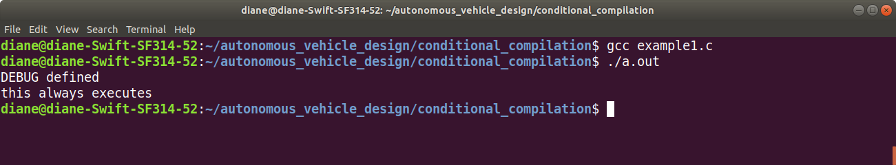
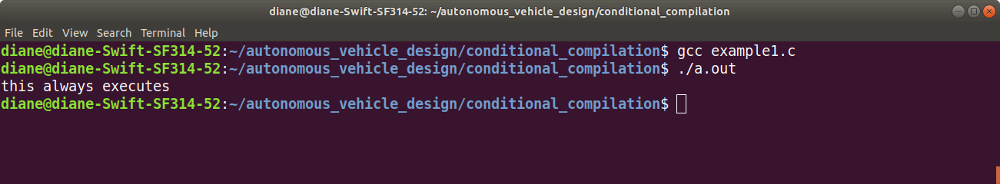
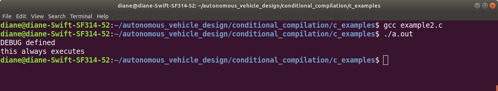
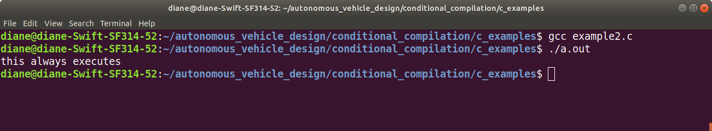
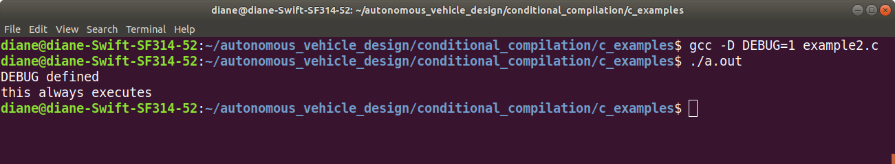
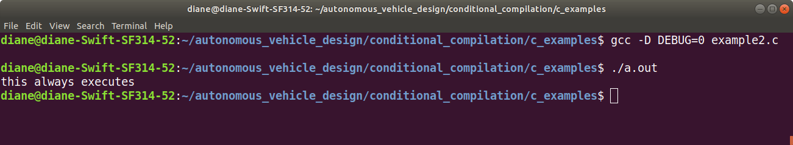
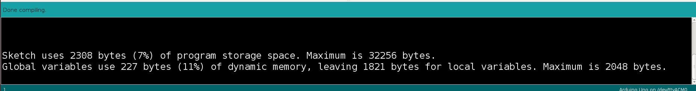
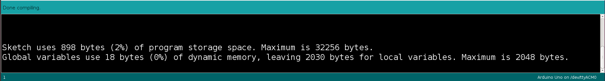

# Conditional Complilation in C Programming Lanuage

Conditional compilation means that the source code is compiled if certain condition(s) hold true. When the condition(s) are false, the source code is not included during compilation. 

Conditional compilation is useful for debugging. Printing information is a useful debugging technique to display information during program testing. After a program is tested and considered working, the debuggining statements are removed, as they are no longer needed. Removing the debug statements shrinks the size of the program and speeds program execution. 

Often, after debugging statements are removed, problems are discovered, and debugging statements have to be added back to the code. Instead of removing the debugging statements, they can be commented out when not needed and uncommented again when needed. This can be a time consuming process. 

The C preprocessor provides a better alternative, conditional compilation. Lines of source code that should be compiled for debugging, are surrounded by #ifdef, #endif directive pairs as follows:

```
#ifdef DEBUG
printf("debug: val = %d\n", val);
#endif 
```

The #ifdef directive specifies that if DEBUG exists as a macro, i.e. defined with a #define directive, then the statements between #ifdef and #endif are retained in the source file sent to the compiler. If DEBUG does not exist as a macro, then these statements are not passed onto the compiler.

To turn on debugging statements, define this macro in the source file.
```
#define DEBUG 
``` 

To turn it off, comment it out, or remove it, then recompile the source code.

In general compilation directives begin with an if and end with an endif. Optionally, there may be an else or elseif inbetween. The preprocessor keywords:
- *if-part: if, ifdef, ifndef*
- *else-part: else*
- *elseif-part: elif*
- *endif-part: endif*

The syntax is

```
#<if-part>
<statements>
[ # <elsif-part>]
<statements>
[ # <elsif-part>]
<statements>
[ # <else-part>]
<statements>
#<endif-part>
```

### example1.c

Compiling and running this example, you can see the DEBUG defined output.

```
#include <stdio.h>

#define DEBUG

int main(void)
{
    #ifdef DEBUG
        printf("DEBUG defined\n");
    #endif 
    printf("this always executes\n");
    return 0;
}
```

Output with #define DEBUG

<br><br>


If the #define DEBUG is commented out as shown below, after compiling and running the program, the debug message does not print out.

```
#include <stdio.h>

// #define DEBUG

int main(void)
{
    #ifdef DEBUG
        printf("DEBUG defined\n");
    #endif 
    printf("this always executes\n");
    return 0;
}
```

Output with no #define DEBUG

<br><br>

## example2.c

This example uses the #if directive instead of the #ifdef directive. The #define DEBUG is changed to #define DEBUG 1.

The statement #if DEBUG is true when DEBUG is 1 and false when DEBUG is 0.


```
#include <stdio.h>

#define DEBUG 1

int main(void)
{
    #if DEBUG
        printf("DEBUG defined\n");
    #endif 
    printf("this always executes\n");
    return 0;
}
```

Output with #define DEBUG 1

<br><br>


Output with #define DEBUG 0

Changing the DEBUG value to 0, compiling and running the program turns off the debugging statements.

<br><br>

All of these do require changing the DEBUG definition within the program. As shown below, removing the #define from the program and using the preprocessor directive -D allows you to define the macro when building the program.

The command gcc -D DEBUG=1 example2.c defines the macro with a value of 1,the equivalent of #define DEBUG 1

The command gcc -D DEBUG=0 example2.c defines the macro with a value of 0, the equivalent of #define DEBUG 0.

Alternatively, gcc example2.c without -D will build the program without the macro defined.


```
#include <stdio.h>

int main(void)
{
    #if DEBUG
        printf("DEBUG defined\n");
    #endif 
    printf("this always executes\n");
    return 0;
}
```

Output with -D DEBUG=1

<br><br>

Output with -D DEBUG=0

<br><br>


## Example 3 - Arduino Conditional Compilation

This technique can be used in an Arduino program. The example uses the Serial.print statements for debugging. Serial communication is enabled when the macro SERIAL_DEBUG is defined. The #ifdef #endif form is used to print debugging information.


```
#define SERIAL_DEBUG 

const unsigned long BLINK_INTERVAL = 500;
unsigned long blinkTime;
unsigned long wasteTime;
byte ledState;

void setup()
{
    #ifdef SERIAL_DEBUG
      Serial.begin(38400);
      delay(250);
      Serial.println("Serial Debug Ready");
    #endif
    pinMode(LED_BUILTIN, OUTPUT);
    ledState = 0;
    digitalWrite(LED_BUILTIN, ledState);
    blinkTime = millis();
}

void loop()
{
    if(millis() - blinkTime >= BLINK_INTERVAL)
    {
        ledState = ledState ^ 0x01;     // toggle state 
        digitalWrite(LED_BUILTIN, ledState);
        blinkTime = millis();
        #ifdef SERIAL_DEBUG
          Serial.print("ledState: ");
          Serial.println(ledState);
          Serial.flush();               // waits for transmission to complete
        #endif 
    }
    else{
      wasteTime = millis();
      while((millis() - wasteTime) < 200);
    }
}
```

### Compilation information with #define DEBUG

The sketch above uses 2308 bytes of program storage space.

<br><br>

### Compilation information without  //#define DEBUG

Commenting out the #define DEBUG macro results in the sketch only using 898 bytes of program memory.

<br><br>

Hopefully, this technique will aid in your debugging and testing, by shortening the amount of time required for adding and removing debugging statements from the source code.

