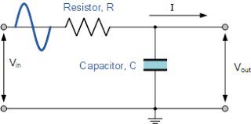

# Digital Low-Pass IIR Filter based on Analog Passive RC Low-Pass Filter

## Analog Passive RC Low-Pass Filter

[Image 1: Low-pass RC Filter][1]

[1]: https://www.electronics-tutorials.ws/wp-content/uploads/2013/08/fil5.gif?fit=326%2C161
 

## Time-Domain Analysis

Using Kirchhoff's Laws and the definition of capacitance:

1) vin(t) - vout(t) = R i(t)
2) Qc(t) = C vout(t)

3) i(t) = &delta;vout / &delta;t

where Qc(t) is the charge stored in the capacitory at time t.

Substituting equation 2 into 3,

4) i(t) = C &delta;vout / &delta;t

Substituting equation 4 into 1 for i(t),

5) vin(t) - vout(t) = RC &delta;vout / &delta;t

 

## Discretize Time Domain Equations

Assume that input and output are sampled at evenly spaced points in time, separated by &Delta;t time. Let the samples of vin be represented by the sequence (x1, x2, x3, ..., xn). Let vout be represented by the sequence (y1, y2, y3, ..., yn).
 

The discrete form of the continous equation 5 is

6) xi - yi = RC (yi - yi-1) / &Delta;t

 
Rearranging the terms gives the recurrence relation

7) yi = xi (&Delta;t)/(RC + &Delta;t) + yi-1 (RC)/(RC + &Delta;t)

 
Let &alpha; = (&Delta;t)/(RC + &Delta;t).

The discrete time implementation of the RC low-pass filter is

8) yi = &alpha; xi + (1-&alpha;) yi-1

 
Recognize that this is in the form of an infinite impulse response filter. It is an exponentially weighted moving average. The &alpha; value is an exponential smoothing factor, whose function is to remove high-frequency noise.

By definition, the smoothing factor, &alpha; is subject to 0 <= &alpha; <= 1

Larger values of &alpha; reduce the level of smoothing. Values of &alpha; close to 1 give greater weight to recent changes in data, while values of &alpha; closer to zero have a greater smoothing effect and are less responsive to recent changes. There is no formally correct procedure for choosing &alpha;  
 

The time constant RC is 

9) RC = &Delta;t ((1-&alpha;)/&alpha;)

 
The cutoff frequency fc is

10) fc = 1 / (2 &pi; RC)

 
Rearranging equation 10,

11) RC = 1 / (2 &pi; fc)

 
Making &alpha; and fc related by

12) &alpha; = (2 &pi; &Delta;t fc) / (2 &pi; &Delta;t fc + 1)

13) fc = &alpha; / ( (1-&alpha;) 2&pi;&Delta;t)

