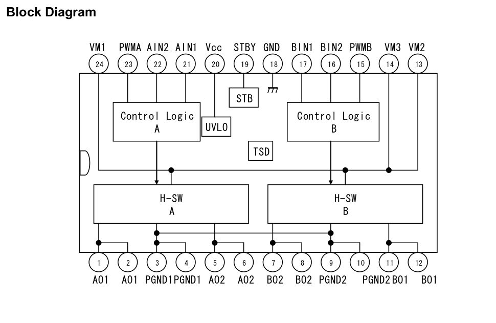
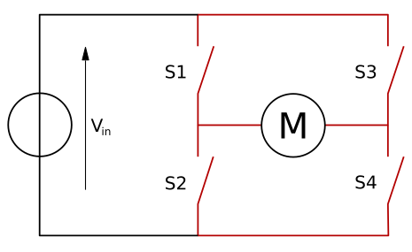
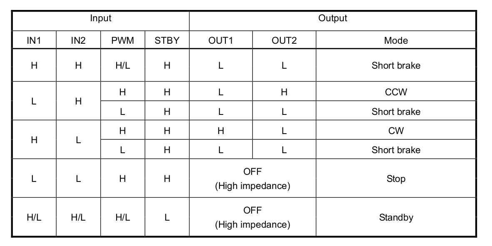

# Lesson 1 - Elegoo Self-Balancing Robot, Spinning the Motors

The robot's dual motor driver IC is the TB6612FNG. It uses two input signals, IN1 and IN2 to choose one of four modes: CW, CCW, short brake, and stop. See the [TB6612FNG.pdf](../datasheets/TB6612FNG.pdf) document and the usage [Application note](../datasheets/TB6612FNG_application_note.pdf) in the datasheets directory for the driver's specifications.</br></br>

## Motor Driver Block Diagram

The block diagram provides the pinout and a structural overview of the integrated circuit's design. The control logic blocks read the state of the input pins PWMA, AIN2, AIN1, BIN1, BIN2, and PWMB to control the switching of the H-bridge switching circuits, H-SW A and H-SW B. 

This is a dual motor driver, meaning it can separately control two DC motors. This is why the circuity is labeled A, B. One motor will be connected to and controlled by the A driver, while the other motor is wired to the B side.</br></br>


</br></br>

### H-Bridge

An H-Bridge is an electronic circuit that switches the polarity of a voltage applied to a load. These circuits are used to allow DC motors to run forward or backward. 

The term *H bridge* is derived from the graphical representation of the circuit. An H bridge is built with four switches, laid out in an H pattern. When the switches S1 and S4 are closed (S2 and S3 open) a positive voltage will be applied across the motor. By opening switches S1 and S4, closing S2 and S3, the voltage is reversed, allowing reverse operation of the motor. </br></br>

 [1](https://upload.wikimedia.org/wikipedia/commons/thumb/d/d4/H_bridge.svg/465px-H_bridge.svg.png)

</br></br>

#### H-Bridge Operation

Generally, the H-bridge is used to reverse the polarity/direction of the motor, but can also be used to "brake" the motor, where the motor comes to a sudden stop, as the motor's terminals are shorted. It can also let the motor coast to a stop, as the motor is effectively disconnected from the circuit. The table below shows the switch state of S1-S4 for these operations. A value of 1 means the switch is closed, while 0 means the switch is open.

| S1 | S2 | S3 | S4 | Result |
| --- | --- | --- | --- | --- |
| 1 | 0 | 0 | 1 | Motor moves right (CW)|
| 0 | 1 | 1 | 0 | Motor moves left (CCW)|
| 0 | 0 | 0 | 0 | Motor coasts|
| 1 | 0 | 0 | 0 | Motor coasts |
| 0 | 1 | 0 | 0 | Motor coasts |
| 0 | 0 | 1 | 0 | Motor coasts |
| 0 | 0 | 0 | 1 | Motor coasts |
| 0 | 1 | 0 | 1 | Motor brakes|
| 1 | 0 | 1 | 0 | Motor brakes|
| x | x | 1 | 1 | Short circuit|
| 1 | 1 | x | x | Short circuit|

[2](https://en.wikipedia.org/wiki/H-bridge#:~:text=An%20H%2Dbridge%20is%20an,to%20run%20forwards%20or%20backwards.)

</br></br>

### Controlling Motoer Operation with the TB6612FNG 

The data sheet's H-SW control function table provides the pin state values for the various motor modes.</br></br> 


</br></br>

The first row tells us that when input pins IN1, IN2, STBY are set high, the motor outputs OUT1, OUT2 are both set low, short brake mode. The H-SW Operation Description images show the H-bridge switch states. Short braking essentially short-circuits the motor terminals, driving them to the same low level. The braking energy of the motor will be shorted through the power or ground rail, essentially turning the motor into an electric generator. The brake mode senses the motor is moving and applies power to keep the motor in place. Think of it like suddenly applying the brakes on your car. It is a sudden stop, compared to coasting to a stop.
</br></br>

The second row tells us that with IN1 low, IN2 high, PWM high, STBY high, the motor will turn counter-clockwise. The polarity of the motor outputs is OUT1 low, OUT2 high.

To spin the motor clockwise, set IN1 high, IN2 low, PWN high, STBY high. The motor output OUT1 is high with OUT2 low, the opposite polarity of the CCW mode.

The standby mode is a power saving mode. The STBY input is set low. The motor outputs are in a high impedance state and all transistors in the H-bridge are turned off.

Stop mode is entered when the STBY is set high, PWM high, IN1 low, IN2 low. The motor outputs are in a high impedance state.

</br></br>

### Pin Connections to Elegoo PCB

The table below maps the Elegoo PCB pin names to the motor driver IC pin names. The Elegoo pin names are stenciled on the PCB where the motor driver is connected to its headers, and on the PCB where the breakout header connections to the Arduino Nano are found.

Example: The TB6612FNG data sheet shows pin name IN1, which the Elegoo PCB calls AIN1. AIN1 is connected to Arduino pin 7.</br></br>

**Pin Numbers**

| TB6612FNG | Elegoo PCB  | Arduino Nano |
| --- | --- | --- |
| IN1 | AIN1 | 7 |
| IN2 | BIN1 | 12 |
| PWMA | PWMA | 5 |
| PWMB | PWMB | 6 |
| STBY | STBY | 8 |

</br></br>

## Arduino Low-level motor control

The next step is writing an Arduino sketch to implement simple motor functions such as forward, backward, and stop.</br></br>

### Pin Definitions

Start by defining the Arduino pin connections to the motor driver. The code below uses the Elegoo PCB names: AIN1, BIN1, STPY. The left and right description is added to the PWM pin names, but that is subjective dependent on the robot's orientation.

```cpp
#define AIN1         7    // direction left motor
#define PWMA_LEFT    5    // pulse width modulation

#define BIN1        12    // direction right motor
#define PWMB_RIGHT   6    // pulse width modulation

#define STBY         8    // standby mode  
```
</br></br>
The Nano pinout is shown below. Note that Arduino pins 5 and 6 are capable of generating an pwm signal.</br></br>

</br></br>

### Initialize motors

The Arduino sketch writes data to the above pins, defining them as Arduino outputs. The initialization function sets the pin mode. Technically, you do not need to call pinMode() to set the pwm pin as an output before calling analogWrite().

Note that pins 5 and 6 produce a 980 Hz pwm frequency, compared to the 490 Hz generated by the pwm pins. [3](https://www.arduino.cc/reference/en/language/functions/analog-io/analogwrite/)

```cpp
void initMotors( void)
{
  pinMode(AIN1, OUTPUT);
  pinMode(BIN1, OUTPUT);
  pinMode(PWMA_LEFT, OUTPUT);
  pinMode(PWMB_RIGHT, OUTPUT);
  pinMode(STBY, OUTPUT);
  stopMotors();
}
```
</br></br>

### Drive Forward

Driving forward requires both motors to spin in the same direction. Forward depends on how the motors are mounted. On the test robot, setting the direction pins on both motors to low produced a counter clockwise rotation, propelling the robot forward. Forward is defined as the direction the ultrasonic range finder faces.

The motor speed is controlled by the voltage level produced by a pulse width modulation signal. Note that there is no digitalwrite to the STBY pin in either the driveFoward or driveBackward functions. This assumes the STBY has already been set to high prior to calling these functions. You may want to structure your code differently. </br>

```cpp
void driveForward(unsigned char speed)
{
  digitalWrite(AIN1, 0);
  digitalWrite(BIN1, 0);
  analogWrite(PWMA_LEFT, speed);
  analogWrite(PWMB_RIGHT, speed);
}
```

</br></br>

### Drive Backward

Driving backward also requires both motors to spin in the same direction. On the test robot, setting the direction pins on both motors to high produced a clockwise rotation, propelling the robot backward. 

The motor speed is controlled by the voltage level produced by a pulse width modulation signal.

```cpp
void driveBackward(unsigned char speed)
{
  digitalWrite(AIN1, 1);
  digitalWrite(BIN1, 1);
  analogWrite(PWMA_LEFT, speed);
  analogWrite(PWMB_RIGHT, speed);
}
```

</br></br>

### Stop

The control function chart shows that both direction pins are set low and the standby pin is set high. The Arduino function sets the pwm voltage to zero

```cpp
void stopMotors(void)
{
  digitalWrite(AIN1, LOW);
  digitalWrite(BIN1, LOW);
  digitalWrite(STBY, HIGH);
  analogWrite(PWMA_LEFT, 0);
  analogWrite(PWMB_RIGHT, 0);
}
```

</br></br>

### lesson1 sketch

[lesson1.ino](./lesson1/lesson1.ino) tests these functions by initializing the motors, spinning them forward for a few seconds, then backward, and stopping.
