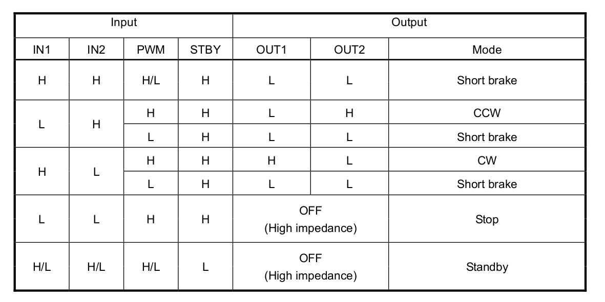

# Lesson 2 - Spinning the Motors

The robot's dual motor driver IC is the TB6612FNG. It uses two input signals, IN1 and IN2 to choose one of four modes: CW, CCW, short brake, and stop. See the [TB6612FNG.pdf](./datasheets/TB6612FNG.pdf) document in the datasheets directory for the driver's specifications.

The table below attempts to reconcile the pin names found in the data sheet, on the PCB where the motor driver is connected to its headers, and on the PCB where the breakout header connections to the Arduino Nano are found. 

Example: The TB6612FNG data sheet shows pin name IN1, which the Elegoo PCB calls AIN1. AIN1 is connected to pin 7.

**Pin Numbers**
| TB6612FNG | Elegoo PCB  | Arduino Nano |
| --- | --- | --- |
| IN1 | AIN1 | 7 |
| IN2 | BIN1 | 12 |
| PWMA | PWMA | 5 |
| PWMB | PWMB | 6 |
| STBY | STBY | 8 |


Our objective is to write an Arduino sketch to implement simple motor functions such as forward, backward, and stop.

The control functions are shown below. We will use this chart to write some Arduino functions to control the motors.




## Arduino Low-level motor control


### Pin Definitions

Start by defining the Arduino pin connections to the motor driver. The code below uses the Elegoo PCB names: AIN1, BIN1, STPY. The left and right description is added to the PWM pin names, but that is subjective dependent on the robot's orientation.


```
#define AIN1         7    // direction left motor
#define PWMA_LEFT    5    // pulse width modulation

#define BIN1        12    // direction right motor
#define PWMB_RIGHT   6    // pulse width modulation

#define STBY         8    // standby mode  
```

### Initialize motors

The Arduino sketch writes data to the above pins, defining them as Arduino outputs. The initialization function sets the pin mode.

```
void initMotors( void)
{
  pinMode(AIN1, OUTPUT);
  pinMode(BIN1, OUTPUT);
  pinMode(PWMA_LEFT, OUTPUT);
  pinMode(PWMB_RIGHT, OUTPUT);
  pinMode(STBY, OUTPUT);
  stopMotors();
}
```


### Drive Forward

Driving forward requires both motors to spin in the same direction. Forward depends on how the motors are mounted. On the test robot, setting the direction pins on both motors to low produced a counter clockwise rotation, propelling the robot forward. Forward is defined as the direction the ultrasonic range finder faces.

The motor speed is controlled by the voltage level produced by a pulse width modulation signal. 


```
void driveForward(unsigned char speed)
{
  digitalWrite(AIN1, 0);
  digitalWrite(BIN1, 0);
  analogWrite(PWMA_LEFT, speed);
  analogWrite(PWMB_RIGHT, speed);
}
```


### Drive Backward

Driving backward also requires both motors to spin in the same direction. On the test robot, setting the direction pins on both motors to high produced a clockwise rotation, propelling the robot backward. 

The motor speed is controlled by the voltage level produced by a pulse width modulation signal.

```
void driveBackward(unsigned char speed)
{
  digitalWrite(AIN1, 1);
  digitalWrite(BIN1, 1);
  analogWrite(PWMA_LEFT, speed);
  analogWrite(PWMB_RIGHT, speed);
}
```

### Stop

The control function chart shows that both direction pins are set low and the standby pin is set high. The Arduino function sets the pwm voltage to zero

```
void stopMotors(void)
{
  digitalWrite(AIN1, LOW);
  digitalWrite(BIN1, LOW);
  digitalWrite(STBY, HIGH);
  analogWrite(PWMA_LEFT, 0);
  analogWrite(PWMB_RIGHT, 0);
}
```


### lesson2 sketch

[lesson2.ino](./lesson2/lesson2.ino) tests these functions by initializing the motors, spinning them forward for a few seconds, then backward, and stopping.

