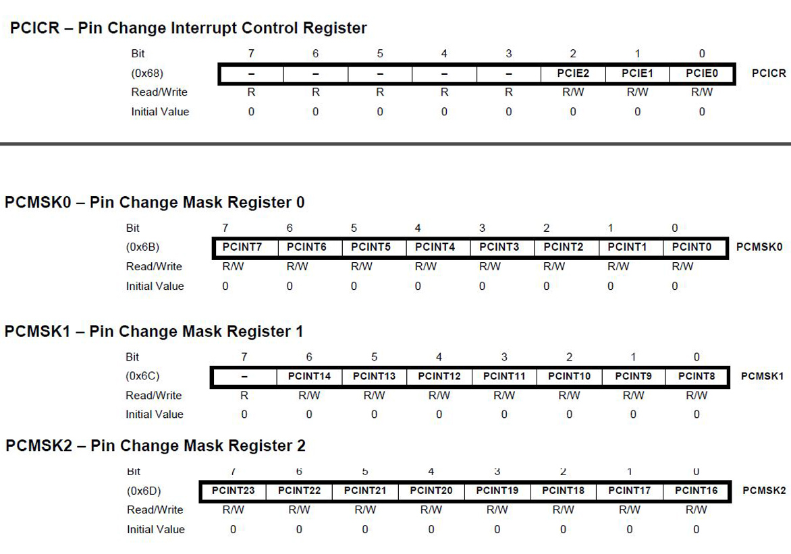

# Arduino Interrupts

There are two main interrupt categories: hardware and software. Hardware interrupts are triggered by something outside of the micro-controller chip. Examples: buttons, encoders. A software interrupt is triggered inside the micro-controller. Example: timers

There are two types of hardware interrupts:<br>
- External
- Pin Change

The interrupts classified as external are limited to specific pins. The ATmega328 has two external interrupts on Arduino Uno/Nano digital pins 2 and 3. Pin change interrupts can occur on any of the pins.  All of the Uno's/Nano's 24 pins may be set up as pin change interrupts.

Each time an interrupt occurs, it triggers an associated ISR (Interrupt Service Routine).  Each of the external interrupts have their own ISRs and can be triggered independently by a rising signal, falling signal, both rising and falling signal, or low voltage level.

The pin change interrupts share an ISR with all the pins on a port. There are three ports: B, C, and D. Anytime a pin changes on that port, it calls the port's ISR which must then determine which pin caused the interrupt. This makes using pin change interrupts a bit more work to program.

The ATmega328 data sheet contains a table of reset and interrupt vectors. Part of the table is shown below. INT0 and INT1 are the interrupt vectors for the Arduino Uno/Nano pins 2 and 3, respectively. The port B, C, and D interrupts are the pin change interrupt vectors.<br>

|Vector Number | Program Address | Source | Interrupt Definition |
| --- | --- | --- | --- |
| 0 | 0x0000 | RESET | External Pin, Power-on Reset |
| 1 | 0x0002 |INT0 | External Interrupt Request 0 |
| 2 | 0x0004 |INT1 | External Interrupt Request 1 |
| 3 | 0x0006 |PCINT0 | Pin Change Interrupt Request 0 |
| 4 | 0x0008 |PCINT1 | Pin Change Interrupt Request 1 |
| 5 | 0x000A |PCINT2 | Pin Change Interrupt Request 2 |

</br>
The source names, INT0, INT1, PCINT0, PCINT1, and PCINT2 will be used when defining the ISR function.</br></br>

## Interrupt Model

When an interrupt event occurs, the processor automatically calls the interrupt service routine.

- Push program counter onto the stack
- Jump to interrupt address
- Global interrupt enable bit in SREG is automatically cleared.
    - i.e. nested interrupts are disabled
- ISR executes then returns
- Global interrupt bit is automatically set on return

The interrupt service routine is never directly called by the program. ISR variables that are also used by the program are globally declared with volatile modifier.</br></br>

## Arduino Language Support for External Interrupts

The Arduino library functions for working with pin change interrupts and external interrupts is different. This section describes how to work with external interrupt pins 2 and 3. The Arduino attachInterrupt function is used to enable the interrupts and register the ISR. The detachInterrupt function is used to turn off the given interrupt.

- Pins
    - 2: INT0
    - 3: INT1

- attachInterrupt(interrupt, function, mode)
    - interrupt: 0 or 1
    - function: interrupt function to call
    - mode: LOW, CHANGE, RISING, FALLING
- detachInterrupt(interrupt)
- interrupts() - enables interrupts, same as sei()
- noInterrupts() - disable interrupts, same as cli()
</br></br>

### Arduino Example: External Interrupt Controls LED State

Suppose we connect a two-position, on/off switch to pin 2. When the switch changes state, it will cause an interrupt.</br></br>

**Global Interrupt Variable**

Variables that are updated in an interrupt service routine must be declared globally. The volatile qualifier is used when declaring the variable.

Declaring a variable volatile is a directive to the compiler. The compiler is software which translates your C/C++ code into the machine code, which are the real instructions for the Atmega chip in the Arduino.

Specifically, it directs the compiler to load the variable from RAM and not from a storage register, which is a temporary memory location where program variables are stored and manipulated. Under certain conditions, the value for a variable stored in registers can be inaccurate.

A variable should be declared volatile whenever its value can be changed by something beyond the control of the code section in which it appears, such as a concurrently executing thread. In the Arduino, the only place that this is likely to occur is in sections of code associated with interrupts, called an interrupt service routine.</br>

```cpp
volatile byte state = LOW;
```
</br></br>

**Setting pin modes**

In this example the switch connected to pin 2 will be wired to ground, with the pinmode configured as INPUT_PULLUP.

There are 20K pullup resistors built into the Atmega chip that can be accessed from software. These built-in pullup resistors are accessed by setting the pinMode() as INPUT_PULLUP. This effectively inverts the behavior of the INPUT mode, where HIGH means the sensor is off, and LOW means the sensor is on.

When connecting a sensor to a pin configured with INPUT_PULLUP, the other end should be connected to ground. In the case of a simple switch, this causes the pin to read HIGH when the switch is open, and LOW when the switch is pressed.

```cpp
pinMode(interruptPin, INPUT_PULLUP);
```
</br></br>

**Setting Up the Interrupt**

The Arduino attachInterrupt function enables the interrupt and registers the ISR to be called when that interrupt occurs. The first parameter to attachInterrupt() is an interrupt number. As seen above, the interrupt number for pin 2 is 0. It is recommended that the macro digitalPinToInterrupt(pin number) be used to convert the pin number to the correct interrupt number.

The second parameter is the name of the interrupt service routine to call when the interrupt occurs. The mode parameter defines when the interrupt should be triggered. This function is normally called once, during setup.</br>

- attachInterrupt(interrupt, function, mode)
    - interrupt: 0 or 1
    - function: interrupt function to call
    - mode: LOW, CHANGE, RISING, FALLING
</br>

```cpp
attachInterrupt(digitalPinToInterrupt(interruptPin), blink, CHANGE);
```

</br></br>

## Programming Interrupt Service Routines

The ISR has no parameters and cannot return anything.

General Guidelines for ISR:

- Make these routines execute as fast as possible
- Write very little code in these functions
- Do not use delays
   - millis() relies on interrupts to count, so it will never increment inside an ISR. Since delay() requires interrupts to work, it will not work if called inside an ISR. micros() works initially but will start behaving erratically after 1-2 ms. delayMicroseconds() does not use any counter, so it will work as normal.(but don't use it)
- Any variables accessed in the ISR should be declared globally with the volatile qualifier.

If your sketch uses multiple ISRs, only one ISR can execute at a time. Other interrupts will be executed after the current one finishes in an order that depends on their priority. Priority is determined by the interrupt vector number. The lower the number, the higher the priority. Example: zero is the highest priority.</br></br></br>

### Complete Arduino Example Sketch - External Interrupt Controls LED State

```cpp
const byte ledPin = 13;
const byte interruptPin = 2;
volatile byte state = LOW;


void setup() {
  pinMode(ledPin, OUTPUT);
  pinMode(interruptPin, INPUT_PULLUP);
  attachInterrupt(digitalPinToInterrupt(interruptPin), blink, CHANGE);
}

void loop() {
 digitalWrite(ledPin, state);
}

void blink(){
  state = !state;
}
```

</br></br></br>

## Arduino Pin Change Interrupts

There are no built-in Arduino libraries at this time for handling pin change interrupts. Fortunately, these are fairly easy to code by following the steps listed below.


###  Steps for Using Pin Change Interrupts

1. Turn on Pin Change Interrupts
2. Select which pins cause interrupts
3. Write an ISR for the interrupt pins
</br></br>

### Select Interrupt Pins

Which pins should be used to generate an interrupt? It is the user's choice, constrained by items such as serial transmission, I2C, timer usage, etc. For example, if the Arduino requires I2C communication with another device, we cannot use analog input pins 5 and 4, as they control the SCL and SDA lines. Digital pins 0 and 1 are used for serial transmission, RX and TX pins.

The image below shows the ATMega328 and Arduino pin mapping.</br></br>

 [4](https://eprojectszone.com/wp/wp-content/uploads/2016/07/arduino-pins.jpg) </br></br>

#### What is a pin's port group?

The ATMega chip has three port groups: Port B, Port C, and Port D. We have to know a pin's port group to enable it as an interrupt.

The pin mapping shows the Arduino pin numbers and the ATMega pin numbers. Find the Arduino digital pin number D0. The corresponding ATMega pin number is PD0. The PD stands for port D. Notice Arduino digital pin numbers D0-D4 correspond to ATMega pin numbers PD0 - PD4. They are all port D pins.

Arduino analog input pins A0 - A5 all belong to port C. The corresponding ATMega pin numbers are PC0 - PC5. Arduino digital pins 8 - 13 are all port B pins.

Suppose we want Arduino digital pin D4, analog input pin A0, and digital pin D12 to be set as pin change interrupts. We need to know the port group and the interrupt bit name.

| Arduino Pin Number | ATMega Pin Number | Interrupt Bit Name |
| --- | --- | --- |
| D4 | PD4 | PCINT20 |
| A0 | PC0 | PCINT8 |
| D12 | PB4 | PCINT4 |

</br>
We need to turn on pin change interrupts for each port that will have an active pin change interrupt. If there are no interrupts in that port, we do not enable the interrupt for a port. For example, if we only need interrupts in port C, we do not enable interrupts in ports B and D. </br></br>

### Turn on Pin Change Interrupts

The Pin Change Interrupt Control Register, PCICR, shown below,  controls the port B, port C, and port D pin interrupts. Bit 0 turns on port B (PCINT0-PCINT7). Bit 1 turns on port C (PCINT8 - PCINT14). Bit 2 turns on port D (PCINT16 - PCINT23).

Register bit names:

- PCIE2: pin change interrupt enable 2
- PCIE1: pin change interrupt enable 1
- PCIE0: pin change interrupt enable 0

</br></br>

The example code below shows how to set the individual bits. Decimal and hexadecimal values may be used in place of the binary.

```cpp
PCICR |= 0b00000001;    // turn on port b interrupt
PCICR |= 0b00000010;    // turn on port c interrupt
PCICR |= 0b00000100;    // turn on port d interrupt
```

</br></br>

 [4](https://2.bp.blogspot.com/-9PcC-sMXMos/VtdZVLm1f6I/AAAAAAAABGI/547N_oz3eME/s1600/Interrupt%2BRegisters%2BOf%2BThe%2BATmega328P.jpg)

</br></br>

### Set Pins to Generate Interrupt

Any pin in the port may be configured to trigger that port's ISR, but only when that pin is set to cause an interrupt. Setting a bit in the Pin Change Mask registers: PCMSK0, PCMSK1, PCMSK2 sets that pin as interrupt pin.

The map image above shows the Arduino pin numbers and their corresponding PCMSK bit name. For our example, we are setting PCINT20, PCINT8, and PCINT4. 

| PCMSK Bit Name | PCMSK Register Number | PCMSK Bit Position |
| --- | --- | --- |
| PCINT20 | PCMSK2 | bit 4 |
| PCINT8 | PCMSK1 | bit 0 |
| PCINT4 | PCMSK0 | bit 4 |
</br>

The code to set these bit values in the corresponding registers is shown below. This configures these pins to generate an interrupt whenever the voltage level changes.</br>

```cpp
PCMSK0 |= 0b0001000;    // set PCINT4, Arduino D12, pin PB4
PCMSK1 |= 0b0000001;    // set PCINT8,  Arduino A0, pin PC0
PCMSK2 |= 0b0001000;    // set PCINT20, Arduino D4, pin PD4
```

</br></br>

### Write the ISR

The functions must be spelled as shown below. The source code is place inside {} like any other function. The ISR does not have a return type. As noted in the comments below, the ISR(PCINT0_vect) function will be executed for all enabled port B pin change interrupts. There is one ISR written for each port with an active pin change interrupt. There may be more than one pin change interrupt enabled in a port.

```cpp
ISR(PCINT0_vect){}  // Port B, PCINT0 - PCINT7
ISR(PCINT1_vect){}  // Port C, PCINT8 - PCINT14
ISR(PCINT2_vect){}  // Port D, PCINT16 - PCINT23
```

### Example Sketch

Let's continue with the example of setting digital pin 12 as a pin change interrupt. Our goal is to simply count the number of changes and print that value every 500 ms.

The function cli() turns off interrupts. The function sei() turns interrupts back on. These are defined in avr/interrupt.h. It's a good idea to turn off all interrupts when setting up an interrupt, to avoid another interrupt from occuring during that time.

The avr/interrupt.h file is included to provide access to the register and bit names.


```cpp
#include <avr/interrupt.h>
#include <Arduino.h>

const unsigned long SAMPLE_TIME = 500; // ms

volatile unsigned char count = 0;   // same as byte type


void mysetup()
{
  pinMode(12, INPUT_PULLUP);
  cli();
  // Enables Port B Pin Change Interrupts
  PCICR |= 0b00000001;    // alternative code: PCICR |= (1 << PCIE0); 

  // set PCINT4, Arduino D12, Port B, pin PB4
  PCMSK0 |= 0b0001000;   // alternative code: PCMSK0 |= (1 <<PCINT4); 
  sei();
 
  Serial.begin(9600);
}

int main(void)
{
  unsigned long startTime;
  unsigned char tempCount;
  mysetup();
  startTime = millis();
  while(1)
  {
    if( (millis() - startTime) >= SAMPLE_TIME)
    {
      startTime = millis();
      tempCount = count;          // read volatile variable and store in another variable
      Serial.print("count: ");
      Serial.println(tempCount);
    }
  }
}


ISR(PCINT0_vect)
{
  count++;
}

```
