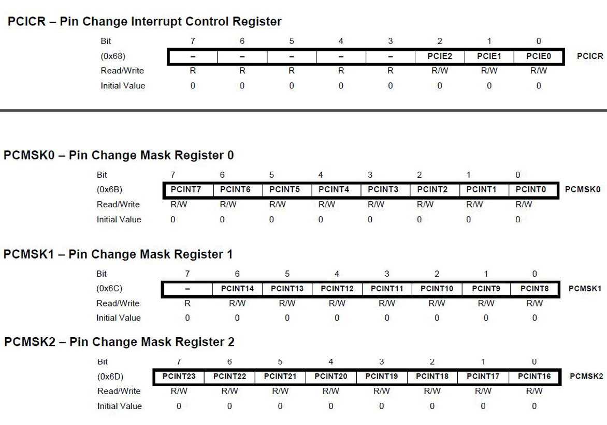

# Arduino Interrupts

There are two main interrupt categories: hardware and software. Hardware interrupts are triggered by something outside of the micro-controller chip. Examples: buttons, encoders. A software interrupt is triggered inside the micro-controller. Example: timers

There are two types of hardware interrupts:<br>
- External
- Pin Change

All interrupts are external to the micro-controller and are limited to specific pins. Pin change interrupts can occur on any of the pins. The ATmega328 has two external interrupts on Arduino Uno/Nano digital pins 2 and 3. All of its 24 pins may be set up as pin change interrupts.

Each time an interrupt occurs, it triggers an associated ISR (Interrupt Service Routine) when an interrupt has been enabled. Each of the External interrupts have their own ISRs and can be triggered independently by a rising signal, falling signal, or by both.

The pin change interrupts share an ISR with all the pins on a port. There are three ports: B, C, and D. Anytime a pin changes on that port, it calls the port's ISR which must then determine which pin caused the interrupt. This makes using pin change interrupts a bit more work to program.

The ATmega328 data sheet contains a table of reset and interrupt vectors. Part of the table is shown below. INT0 and INT1 are the interrupt vectors for the Arduino Uno/Nano pins 2 and 3, respectively. The port B, C, and D interrupts are the pin change interrpt vectors.<br>

|Vector Number | Program Address | Source | Interrupt Definition |
| --- | --- | --- | --- |
| 0 | 0x0000 | RESET | External Pin, Power-on Reset |
| 1 | 0x0002 |INT0 | External Interrupt Request 0 |
| 2 | 0x0004 |INT1 | External Interrupt Request 1 |
| 3 | 0x0006 |PCINT0 | Pin Change Interrupt Request 0 |
| 4 | 0x0008 |PCINT1 | Pin Change Interrupt Request 1 |
| 5 | 0x000A |PCINT2 | Pin Change Interrupt Request 2 |

<br>
<br>

## Interrupt Model 

When an interrupt event occurs, the processor automatically calls the interrupt service routine.

- Push program counter onto the stack
- Jump to interrupt address
- Global interrupt enable bit in SREG is automatically cleared.
    - i.e. nested interrupts are disabled
- ISR executes then returns
- Global interrupt bit is automatically set on return

The interrupt service routine is never directly called by the program. ISR variables that are also used by the program are globally declared with volatile modifier.

## Arduino Language Support for External Interrupts

- Pins
    - INT0 and INT1

- attachInterrupt(interrupt, function, mode)
    - interrupt: 0 or 1
    - function: interrupt function to call
    - mode: LOW, CHANGE, RISING, FALLING
- detachInterrupt(interrupt)
- interrupts() - enables interrupts, same as sei()
- noInterrupts() - disable interrupts, same as cli()

## Arduino Pin Change Interrupts

There are no built-in Arduino libraries at this time for handling pin change interrupts. Fortunately, these are fairly easy to code by following the steps listed below.


###  Steps for Using Pin Change Interrupts

1. Turn on Pin Change Interrupts
2. Select which pins cause interrupts
3. Write and ISR for the interrupt pins


### Turn on Pin Change Interrupts

The Pin Change Interrupt Control Register, PCICR, shown below,  controls the port B, port C, and port D pin interrupts. Bit 0 turns on port B (PCINT0-PCINT7). Bit 1 turns on port C (PCINT8 - PCINT14). Bit 2 turns on port D (PCINT16 - PCINT23).




https://2.bp.blogspot.com/-9PcC-sMXMos/VtdZVLm1f6I/AAAAAAAABGI/547N_oz3eME/s1600/Interrupt%2BRegisters%2BOf%2BThe%2BATmega328P.jpg 


The example code below shows how to set the individual bits. Decimal and hexadecimal values may be used in place of the binary.

```
PCICR |= 0b00000001;    // turn on port b interrupt
PCICR |= 0b00000010;    // turn on port c interrupt
PCICR |= 0b00000100;    // turn on port d interrupt
```


### Select Interrupt Pins

Any pin in the port may be configured to trigger that port's ISR, but only when that pin is set to cause an interrupt. Setting a bit in the Pin Change Mask registers: PCMSK0, PCMSK1, PCMSK2 sets that pin as interrupt pin.

The map image below shows the Arduino pin numbers and their corresponding PPCMSK bit name. 
<br>
<br>


https://baremetalmicro.com/assets/tutorial_avr_digital_io/pin_change_int_pins.png 


<br>
<br>
For example, Arduino digital pin 9 maps to PCINT1, which is bit number 1 PCMSK0 register. To set digital pin 9, PCINT1 to a pin change interrupt: 

```
PCMSK0 |= 0b00000010;  // turn on Arduino digital pin 9 as an interrupt
```


### Write the ISR

The code in an interrupt service routine must execute very quickly. There should be as little code as possible in the function. Do not use delays and avoid calling other functions. Any variables used in ISRs should be declared as volatile, telling the compiler that the variable could change at any time. The compiler then reloads it into the registers each time, instead of optimizing its storage. The functions must be spelled as shown below. The source code is place inside {} like any other function. The ISR does not have a return type.

```
ISR(PCINT0_vect){}  // Port B, PCINT0 - PCINT7
ISR(PCINT1_vect){}  // Port C, PCINT8 - PCINT14
ISR(PCINT2_vect){}  // Port D, PCINT16 - PCINT23
```

### Example Sketch

Let's continue with the example of setting digital pin 9 as a pin change interrupt. Our goal is to simply count the number of changes and print that value every 500 ms.

The function cli() turns off interrupts. The function sei() turns interrupts back on. These are defined in avr/interrupt.h. It's a good idea to turn off all interrupts when setting up an interrupt, to avoid another interrupt from occuring during that time.


```
#include <avr/interrupt.h>
#include <Arduino.h>

const unsigned long SAMPLE_TIME = 500; // ms

volatile unsigned int count = 0;


void mysetup()
{
  cli();
  PCICR |= 0b00000001; // Enables Port B Pin Change Interrupts
  PCMSK0 |= 0b00000010; // PCINT1
  sei();
 
  Serial.begin(9600);
}

int main(void)
{
  unsigned long startTime;
  mysetup();
  startTime = millis();
  while(1)
  {
    if( (millis() - startTime) >= SAMPLE_TIME)
    {
      startTime = millis();
      Serial.print("count: ");
      Serial.println(count);
      count = 0;
    }
  }
}


ISR(PCINT0_vect)
{
  count++;
}

```