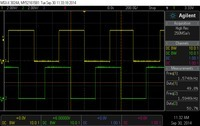

# Lesson 4 - Motor Encoders 

The next capability to add to our robot is travel. At this stage, the control system tries to keep the robot upright by leaning into the direction of its fall. There is no control method to purposefully move the robot forward or backward while maintaining its upright position. This requires adding velocity control to our system.

In this lesson, we'll learn to make the wheels rotate at the desired speed.

## What is a motor encoder?

"An encoder is an electromechanical device that provides an electrical signal that is used for speed and/or position control. Encoders turn mechanical motion into an electrical signal that is used by the control system to monitor specific parameters of the application and make adjustments if necessary to maintain the machine operating as desired. The parameters monitored are determined by the type of application and can include speed, distance, RPM, position among others. Applications that utilize encoders or other sensors to control specific parameters are often referred to as closed-loop feedback or closed-loop control systems." [1]

[1] https://www.dynapar.com/technology/encoder_basics/motor_encoders/ 


## Magnetic Encoders

Looking at the Elegoo motors, we see an attached pcb similiar to the image below. The pcb contains a magnetic encoder similar to the image below.


[2] https://www.pololu.com/product/2598/pictures 


Look at the motor connnectors on Elegoo's BalanceControlRobot-PCB-V06 board, labeled Right_M1, Left_M2. The M+, M- pins provide voltage to the DC motors. The 5V and GND pins provide voltage to the encoder circuit. The encoder circut outputs are A,B. 

The encoder consists of a magnetic disc and two Hall effect sensors. As the motor shaft turns, the magnetic disk rotates past the Hall effect sensors. Each time a magnetic pole passes a sensor, the encoder outputs a digital pulse. The encoder has two ouputs, one for each Hall effect sensors. The sensors are positioned 90 degrees apart, causing the square outputs to be 90 degrees out of phase. This is referred to as quadrature output. The image below provides an example of encoder output.



[2]

The phase difference allows us to determine direction of the motor's rotation. If output A is ahead of output B, the motor is turning forward. If output A is behind output B, the motor is turning backwards.

The magnitude of the motor's rotation is measured by counting the number of pulses.


> To do: Add photos of Elegoo motors and BalanceControlRobot-PCB-V06 board.


## Hardware Interrupts

We need a program that reads the number of encoder pulses and performs other tasks inbetween pulses. Hardware interrupts allow a program to run until an interrupt occurs. 

When interrupts are enabled, the main program runs until the state of one of the Arduino's interrupt pins changes. When the interrupt occurs, the main program stops execution, executes the interrupt service routine, and then the main program resumes execution. The execution time of interrupt services routines must be as fast as possible. If the execution time is too long, the Arduino program will spend all its time executing the interrupt function and never actually run the main program.

The Arduino Nano has two external interrupt pins, INT0 and INT1, mapped to pins 2 and 3. These interrupts can be set to trigger on rising or falling signal edges, or on low level. The triggers are intrepreted by hardware, making the intterupt very fast.

The other type of Arduino interrupt is a pin change. Pin change interrupts can be enabled on any of the other digital pins. 

For more information about Arduino interrupts, see this 


## Arduino Sketch

The Elegoo pcb only connects two of the encoder outputs to the Arduino, each motor's channel A. Arduino pin 2 is connected to M1A. Arduino pin 4 is connected to M2A. This was undoubtedly due to the limited number of Arduino pins.

### Global Variable Scope & Qualifiers

The interrupt service routine (ISR) functions will update encoder count variables each time they execute. The ISR is automatically executed each time the related interrupt occurs. We do not pass nor return variables from these ISR functions. That requires these variables to be declared globally.

Other Arduino functions will also need access to the global encoder count variables. The qualifier **volatile** is used in the global declaration. 

"volatile is a keyword known as a variable qualifier, it is usually used before the datatype of a variable, to modify the way in which the compiler and subsequent program treats the variable.

Declaring a variable volatile is a directive to the compiler. The compiler is software which translates your C/C++ code into the machine code, which are the real instructions for the Atmega chip in the Arduino.

Specifically, it directs the compiler to load the variable from RAM and not from a storage register, which is a temporary memory location where program variables are stored and manipulated. Under certain conditions, the value for a variable stored in registers can be inaccurate.

A variable should be declared volatile whenever its value can be changed by something beyond the control of the code section in which it appears, such as a concurrently executing thread. In the Arduino, the only place that this is likely to occur is in sections of code associated with interrupts, called an interrupt service routine." 

[3] https://www.arduino.cc/reference/tr/language/variables/variable-scope--qualifiers/volatile/ 

An example declaration is shown below. 

```
volatile unsigned long leftEncoderCount = 0;
volatile unsigned long rightEncoderCount = 0;
```


### int or long volatiles

"If the volatile variable is bigger than a byte (e.g. a 16 bit int or a 32 bit long), then the microcontroller can not read it in one step, because it is an 8 bit microcontroller. This means that while your main code section (e.g. your loop) reads the first 8 bits of the variable, the interrupt might already change the second 8 bits. This will produce random values for the variable."

[3] 

While the variable is read, interrupts need to be disabled. One method is to call the noInterrupts function. (https://www.arduino.cc/reference/tr/language/functions/interrupts/nointerrupts/)  

The other method is using the ATOMIC_BLOCK macro. Atomic operations are single MCU operations - the smallest possible unit.

```
#include <util/atomic.h> // this library includes the ATOMIC_BLOCK macro.
volatile int input_from_interrupt;

  ATOMIC_BLOCK(ATOMIC_RESTORESTATE) {
    // code with interrupts blocked (consecutive atomic operations will not get interrupted)
    int result = input_from_interrupt;
  }
```


### ISR (interrupt service routine)

The purpose of each encoder interrupt service routine is to update the encoder count. The function will automatically be called for each change in the pin value. The functions are shown below. 

Note that an ISR cannot have any parameters and should not return anything.

```
void leftEncoderISR(void)
{
  leftEncoderCount++;
}

void rightEncoderISR(void)
{
  rightEncoderCount++;
}
```

The ISR functions must be registered using the Arduino attachInterrupt function. arduino.cc/reference/en/language/functions/external-interrupts/attachinterrupt/ 

The attachInterrupt function has three parameters:
- interrupt: the number of the interrupt. Allowed data types: int.
- ISR: the ISR to call when the interrupt occurs; this function must take no parameters and return nothing. This function is sometimes referred to as an interrupt service routine.
- mode: defines when the interrupt should be triggered. Four constants are predefined as valid values: LOW, CHANGE, RISING, FALLING

The attachInterrupt function is usually called at the end of the setup function. 

```
attachInterrupt(digitalPinToInterrupt(LEFT_ENCODER_A_PIN), leftEncoderISR, CHANGE);

```

lesson4.ino provides a template example for the left encoder pin


The right encoder pin requires setting up a pin change interrupt. See ArduinoPinchangeInterrupts.md


