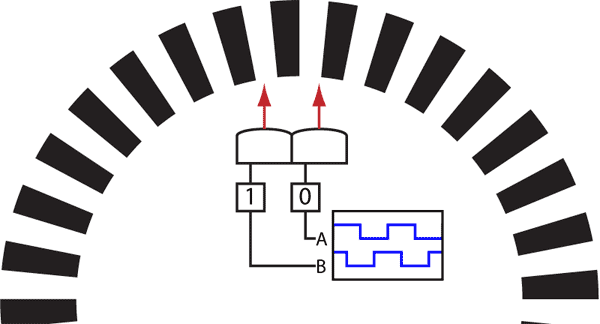

# Lesson 4 - Motor Encoders 

In this lesson, we will learn how to estimate motor speed by reading the motor encoders.</br></br>

## What is a motor encoder?

"An encoder is an electromechanical device that provides an electrical signal that is used for speed and/or position control. Encoders turn mechanical motion into an electrical signal that is used by the control system to monitor specific parameters of the application and make adjustments if necessary to maintain the machine operating as desired." [1]

[1] https://www.dynapar.com/technology/encoder_basics/motor_encoders/ 


## Quadrature Encoders

Quadrature encoders are sensors used to measure the speed and direction of a rotating shaft. The quadrature encoder has at least two outputs: Channel A and B. Each channel produces a digital pulse when the rotating shaft is in motion. The pulses follow a particular pattern that allows you to tell which direction the shaft is rotating. You can also derive the speed by measuring the amount of time between pulses, or the number of pulses per second.

The animiated gif illustrates how a quadrature encoder works. This type of encoder has a black and white reflective code wheel inside a wheel's rim. A pair of reflective sensors produce the pattern of pulses shown in the animation. </br></br>

 [1](http://www.creative-robotics.com/sites/default/files/tutorials/QuadratureAnimation.gif)
</br></br>

The pulses are 90 degrees out of phase so that one pulse always leads the other pulse by one quarter of a complete cycle. A cycle is a complete transition from low -> high -> low. The pulse order changes when the rotation direction changes. The diagrams below illustrate what the two pulse patterns look like for clockwise and counter clockwise rotation.</br></br>

 [2](http://www.creative-robotics.com/sites/default/files/tutorials/quadraturediagram.gif)
</br></br>

The top diagram shows clockwise rotation. Looking at channel A, we see that when it goes from low to high and channel B is low, rotation is clockwise. 

The bottom diagram shows counter-clockwise rotation. When channel A goes from low to high and channel B is high, rotation is counter-clockwise.</br></br>

## Elegoo Self-Balancing Robot - Magnetic Encoders

Looking at the Elegoo motors, we see an attached pcb similiar to the image below. The pcb contains a magnetic encoder similar to the image below.

 [3](https://www.pololu.com/product/2598/pictures) </br></br>


Look at the motor connnectors on Elegoo's BalanceControlRobot-PCB-V06 board, labeled Right_M1, Left_M2. The M+, M- pins provide voltage to the DC motors. The 5V and GND pins provide voltage to the encoder circuit. The encoder circut outputs are A,B. 

The encoder consists of a magnetic disc and two Hall effect sensors. As the motor shaft turns, the magnetic disk rotates past the Hall effect sensors. Each time a magnetic pole passes a sensor, the encoder outputs a digital pulse. The encoder has two ouputs, one for each of the Hall effect sensors. The sensors are positioned 90 degrees apart, causing the square wave outputs to be 90 degrees out of phase. This is the quadrature output discussed above.


## Arduino Sketch - Elegoo Self-Balancing Robot

The Elegoo pcb only connects two of the encoder outputs to the Arduino, each motor's channel A. Arduino pin 2 is connected to M1A. Arduino pin 4 is connected to M2A. This was undoubtedly due to the limited number of Arduino pins.

Variables that are updated in an ISR are declared globally, with the volatile qualifier.

```
volatile unsigned long leftEncoderCount = 0;
volatile unsigned long rightEncoderCount = 0;
```

</br></br>

### int or long volatiles

"If the volatile variable is bigger than a byte (e.g. a 16 bit int or a 32 bit long), then the microcontroller can not read it in one step, because it is an 8 bit microcontroller. This means that while your main code section (e.g. your loop) reads the first 8 bits of the variable, the interrupt might already change the second 8 bits. This will produce random values for the variable." [4](https://www.arduino.cc/reference/en/language/variables/variable-scope-qualifiers/volatile/)

While the variable is read, interrupts need to be disabled. One method is to call the noInterrupts function. (https://www.arduino.cc/reference/tr/language/functions/interrupts/nointerrupts/)  

The other method is using the ATOMIC_BLOCK macro. Atomic operations are single MCU operations - the smallest possible unit.</br></br>

```cpp
#include <util/atomic.h> // this library includes the ATOMIC_BLOCK macro.
volatile int input_from_interrupt;

  ATOMIC_BLOCK(ATOMIC_RESTORESTATE) {
    // code with interrupts blocked (consecutive atomic operations will not get interrupted)
    int result = input_from_interrupt;
  }
```

</br></br>
[lesson4.ino](./lesson4/lesson4.ino) provides a template example for the left encoder pin. The right encoder pin requires setting up a pin change interrupt. 
