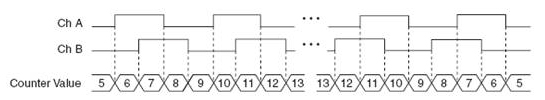
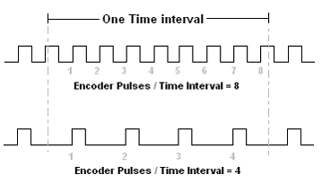

# Lesson 5 - Encoder Angle Estimation

The motor encoders are incremental encoders that output signals on two channels: A,, B, offset by 90 degrees (in quadrature). The direction of the rotation can be determined by which channel is leading. Generally, if channel A is leading, the direction is taken to be clockwise, and if channel B is leading, the direction is counterclockwise.

Quadrature output also allows the encoder’s resolution to be increased, by using X2 or X4 decoding techniques. With X2 decoding, both the rising and falling edges of channel A are counted, doubling the number of pulses counted for each rotation, and therefore doubling the encoder’s resolution. With X4 decoding, the rising and falling edges of both channels A and B are counted, increasing the resolution by four times.

[1] https://3l4sbp4ao2771ln0f54chhvm-wpengine.netdna-ssl.com/wp-content/uploads/2015/09/X4-Encoding.jpg 

## How do we measure an angle with an encoder?

Motor shaft rotation generates encoder pulses. The number of pulses per revolution provide the information needed to estimate the angular position of the robot's wheel or motor shaft.

The motor datasheet is found [here](../datasheets/GB37 with encoder.pdf). The motor is equipped with two Hall sensors to read speed and rotation direction. 

> Hall Speed Code disk, AB dual phase output  
>>Pulses per revolution: 30 * 13 *2 = 780  
    Single phase is 390

The dual phase output requires counting both the A and B pulses. A pulse count of 780 represents one complete "wheel" revolution per the documentation.

The single phase output requires counting only the A or the B pulse. Our robot is wired to only count the A channel of each encoder. We, therefore, expect a count of 390 represents one complete wheel revolution.

The angular resolution per single phase count is 

(360 degrees/revolution) / (390 count/revolution) = 0.923 degrees/count
 
 

## How do we estimate velocity with an encoder?

**Pulse Counting**

Pulse counting uses a sampling period (t) and the number of pulses (n) that are counted over the sampling period to determine the average time for one pulse. (t/n). Knowing the number of pulses per revolution (N) for the encoder, the angular speed (&omega;) is calcualted as

&omega; = (2 &pi n)/(Nt)

&omega; = angular speed (rad/s) 
n = number of pulses 
t = sampling period (s) 
N = pulses per rotation 

[2] https://3l4sbp4ao2771ln0f54chhvm-wpengine.netdna-ssl.com/wp-content/uploads/2017/07/Encoder-Pulses-Time-Interval.gif 

At low speeds, the resolution of pulse counting is poor. This method is best applied in high speed applications. 
 

**Pulse timing**

Pulse timing uses a high-frequency clock signal is counted during one encoder period. The number of cycles of the clock signal (m), divided by the clock frequency (f), gives the time for the encoder period.

Angular speed is calculated as 

&omega; = 2&pi;f / Nm 

&omega; = angular speed (rad/s) 
f = clock frequency (Hz) 
m = number of clock cycles 
N = pulses per rotation 

At high speeds, there may not be enough time between pulses to accurately measure clock cycles. This method is best for low speed applications.

We will use pulse counting for our robotic motor control application. 

**Accuracy of speed measurement**

The encoder speed measurement accuracy can be affected by instrument errors and quantization error. Instrument errors are due to mechanical imperfections in the encoder. Quantization errors are due to the lack of information between pulses. Quadrature encoders only read the *edges* of the signals on channels A and B. The quantization error is +- 1/2 of the measuring step, or count.

