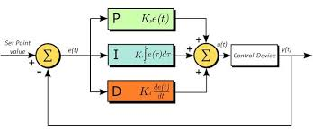
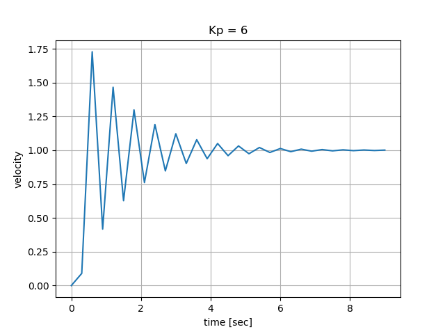

# Lesson 5 - Introduction to PID Control 

Our self-balancing robot needs a control system to keep it balanced while moving around in the world. The Proportional Integral Derivative (PID) controller will be used to control the speed and direction of the robot's motors, based on input from the robot's accelerometer and gyroscope. 

This unit introduces the concepts of open loop versus closed loop control and provides examples to illustrate how the PID control system parameters Kp, Kd, and Ki affect the system.

## Open Loop Control

The simplest form of control is an open loop system. Suppose we want our robot to travel from point A to point B. Based on the distance between the two points, a command is issued to drive at some speed for a specified amount of time. 

The input, distance to travel, is sent to the controller that calculates the required speed for a specified time duration. That is converted to an actuating signal, such as a voltage, sent to the motors (plant). 

As shown in the image below, an open loop system provides no feedback. Without feedback, there is no way to know if the motors reached the target velocity. Mechanical imperfections, friction, travel surface, and other factors will likely keep the motors from maintaining the constant velocity ordered by the controller. The robot will likely not find itself at the desired location at the end of time interval. 


https://3.bp.blogspot.com/-_qLN-F4tdt0/XHvvBmm-giI/AAAAAAAAAoc/-5jeGJTqQMgMkiS6deb39jIPXUAq3fIEgCLcBGAs/s1600/Capture2.PNG 


## Closed Loop Control

The feedback of a closed loop controller allows us to monitor the system state and adjust the control signal when the output does not match the goal state.


https://www.tutorialspoint.com/control_systems/images/closed_loop.jpg 


## PID (Proportional, Integral, Derivative) Control

The PID controller is the classic example of closed loop control. A PID control loop as a process variable which is the system parameter that needs to be controlled. The **reference value** or **set point** is the value we want the system to maintain with regards to te system output. The difference between the reference value and the system output is known as the **error**.





https://www.thorlabs.com/images/TabImages/PID2.jpg 


The proportional (P) term refers to the error between the sensor output and the reference, the present state error.

The integral (I) term refers to the accumulated error for the total system runtime, the past state error.

The derivative (D) term refers to the rate of change of the error within the PID control loop and is used to improve the control loop performance. This term tries to predict future error. 

In practice, the D-term is often not used because it may sometimes amplify noise. Most controllers are PI type controllers.

The PID control loop requires **tuning** to optimize system performance. The tuning parameters are the **K** constants of the system: Kp, Ki, and Kd.


https://trinirobotics.com/wp-content/uploads/2019/03/pic-controller.png 


## Proportional Control

A simple mathematial relationship for the control signal u(t) in terms of the error e(t) is that the magnitude of the control signal is proportional to the error.

u(t) = K<sub>p</sub> e(t)

The value K<sub>p</sub> is referred to as the **gain** term. This is a constant that determines how large the control signal will be for a particular error value. The K<sub>p</sub> is selected based on a system analysis or through trial and error. Larger proportional gain results in larger changes in response to error and affects the speed at which the controller can respond to changes in the system. A high proportional gain can cause a circuit to respond quickly, but too high a value can cause oscillations about the set point value. Too low a Kp value and the circuit cannot efficiently respond to changes in the system.


## Proportional Control Example

The program kp.py provides an example of a proportional control system for velocity control. The program starts with an initial velocity different from the desired set point velocity. Run the program for various values of K<sub>p</sub> to see the effects on the rise time, overshoot, and oscillation.

The initial velocity is 0.0 and the desired set point velocity is 1.0. Acceleration is the signal controlled by the proportional controller. The error between measured velocity (system output) and the set point (desired velocity) is multiplied by K<sub>p</sub> to change the acceleration. 

The program's control loop is shown below. The presentVelocity represents the control system output. The acceleration is the control system input, the actuation signal. The error is calculated and the acceleration signal is updated, based on the error and the proportional control constant K<sub>p</sub>. The acceleration signal has a maximum limit to simulate that real hardware have physical limits.

```
while True:
    presentVelocity = presentVelocity + acceleration * dt
    error = desiredVelocity - presentVelocity
        
    if error > 0:   # present velocity is too slow, less than desiredVelocity
        acceleration = min([ kp * error, accelLimit])
    elif error < 0: # present velocity too fast, decrease it
        acceleration = max([kp*error, -accelLimit])
    else: # error == 0, at desired speed
        acceleration = 0 
```

The first plot below shows the response for Kp = 5. There is overshoot and then the system slowly settles to the desired velocity. Note that this is a simulated example and a real world system will contain an offset bias from accumulated error. 


If we start increasing Kp by 1, the system becomes increasingly unstable.For Kp = 6, the overshoot is larger and the systems takes longer to settle to a steady state. 




At Kp = 7, the system begins to oscillate


The next plot shows the response for Kp = 10. The maximum overshoot is 15 times the desired velocity and the system exhibits a regular periodic oscillation.


## Derivative Control

Derivative control attempts to reduce the overshoot and ringing potential from proportional and integral control. It uses the derivative of the error signal and multiplies it by K<sub>d</sub>. Derivative control will slow the control system response. This partially compensates for the overshoot and damps out oscillations caused by integral and proportional control. High K<sub>d</sub> gain values slow the response, leaving the system susceptible to noise and frequency oscillation. 


## Proportional Derivative Control Example

The program kpkd.py provides adds a derivative control parameter K<sub>d</sub> to the proportional control program example. The simulated control loop code is shown below.

The rate of change in the error is calculated, in addition to the error. The controller input signal, acceleration, is dependent on both the proportional magnitude control the rate of change derivative term.


```
while True:
    
    presentVelocity = presentVelocity + acceleration * dt
    error = desiredVelocity - presentVelocity
    derrdt = (error - prevError) / dt 
    acceleration = kp * error + kd * derrdt
    if abs(acceleration) > accelLimit:
        if acceleration > 0:
            acceleration = accelLimit 
        else:
            acceleration = -accelLimit

    prevError = error 
```

Run the program for various values of K<sub>p</sub> to see the effects on the rise time, overshoot, and oscillation.

The plot below shows the control system response for Kp = 5, Kd = 0.025. For the proportional only controller, Kp = 5, did not cause the system to oscillate. Setting the parameter Kd to 0.025 has not decreased overshoot magnitude and caused some early ringing in the system before it settled to the set point value.


Increasing Kd causes the system to become unstable, as shown below.


Adding a derivative control term to this example made the system response worse than just the P controller. Note that this is just a simulation example and that there are systems where derivative control helps improve performance.


## Integral Control

Integral control is proportional to both the magnitude of the error and the duration of the error. It is highly effective at increasing the response time and eliminating the steady-state error associated with purely proportional control. The integral control sums over the previous error, which has not yet been corrected, and multiplies the error by the K<sub>i</sub> constant. High gain values can cause significant overshoot of the set point value, leading to oscillation and instability. If the constant is too low, then the system will be significantly slower in responding to system changes.

## Proportional Integral Derivative Control Example

Integral control may be added to the previous program by adding a Ki parameter and the following code to the control loop.

```
errorSum = errorSum + error * dt 
acceleration = kp * error + ki * errorSum + kd * derrdt 
```

## Gain Parameter Effect

The chart below shows the effects of increasing any one of the gain parameters independently.

| Closed Loop Response | Rise Time | Overshoot | Settling Time | Steady-State Error | Stability |
| --- | --- | --- | --- | --- | --- |
| Increasing Kp | Decrease | Increase | Small Change | Decrease | Degrade |
| Increasing Ki | Decrease | Increase | Increase | Large Decrease | Degrade |
| Increasing Kd | Minor Decrease | Minor Decrease | Minor Decrease | No effect | Improve (for small Kd) |


## Tuning

In general, a PID controller will typically overshoot the set point value slightly and then quickly damp out to reach the set point value.

### Manual Tuning

This is the simplest method, with the system actively turned on to observe its behavior. The integral and derivative gains are set to zero. Increase the proportional gain until you observe oscillation in the output. Set the proportional gain to roughly half that value. Example: system osciallates at Kp = 90, set Kp to about 45. 

After the proportional gain is set, increase the integral gain until any offset is corrected for on a time scale appropriate to the system. If the gain is too large, you will observe significant overshoot of the set point value and instability in the system. 

The derivative gain is set, after the integral gain is determined. The purpose of the derivative gain is to reduce overshoot and damp the system quickly to the set point value. It the derivative gain is too large, the overshoot will be large, as the system will be slow to respond.

The Ziegler-Nichols method for PID tuning offers some guidance for the PID values. Set the derivative and integral gains to zero. Increase the proportional gain until the system begins to oscillate. This gain level where the system oscillates is called K<sub>u</sub>. The oscillation will have a period of P<sub>u</sub>. Gains are then set as shown in the table below.

| Control Type | K<sub>p</sub> | K<sub>i</sub> | K<sub>d</sub> |
| --- | --- | --- | --- |
| P | 0.50 K<sub>u</sub> | - | - |
| PI | 0.45 K<sub>u</sub> | 1.2 K<sub>p</sub> / P<sub>u</sub> | - |
| PID | 0.60 K<sub>u</sub> | 2 K<sub>p</sub> / P<sub>u</sub> | K<sub>p</sub> P<sub>u</sub>  / 8 |


## Next Steps 

The next lesson explores how to implement a PID control system to balance our robot.
