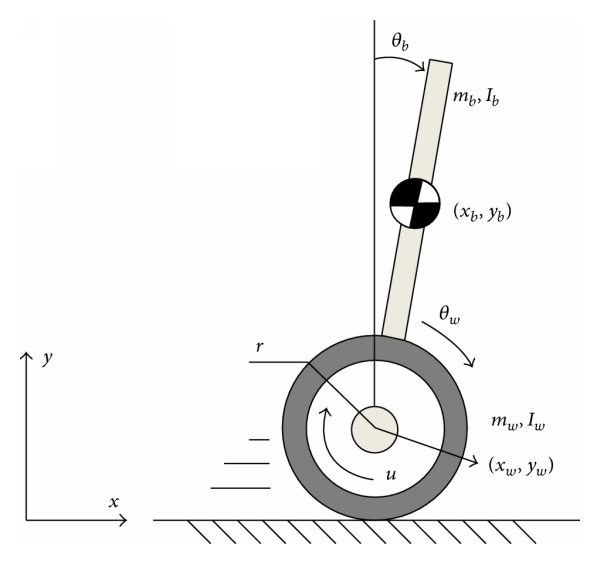
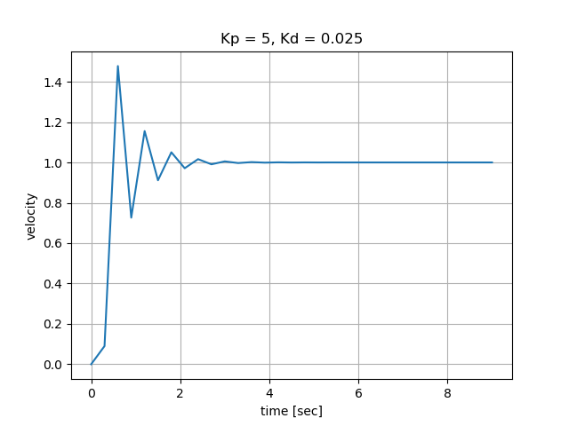

<<<<<<< HEAD
# Lesson 5: Self-Balancing Control System Using Gyroscope & Accelerometer

Control - The Inverted Pendulum Problem

Balancing robots represent the classic inverted pendulum problem, in which a large mass is placed at the end of a pole. The pole is free to rotate around the base, and the base is free to move in the plane perpendicular to the vertical. The goal is to keep the pole vertical by moving the base in response to changes in the angle.



[1] https://www.researchgate.net/profile/Jian_Huang14/publication/285576864/figure/fig6/AS:328305132752907@1455285451614/Mobile-wheeled-inverted-pendulum-MWIP-system-model.png 


An inverted pendulum is inherently unstable. The slighest disturbance from the equilibrium position produces a force away from the equilibrium point that destabilizes the system. Balancing the robot requires a low-latency control system to instantly correct any errors in tilt.


## How do we balance the robot?

We keep the robot balanced by continually moving the wheels under the vehicle as it falls. The robot's wheels are driven in the direction of its fall to counteract the fall. That keeps the robot's center of gravity above its pivot point. We will implement a PID controller that uses tilt feedback to control the motor and keep the robot balanced.


## PID Control System

The control system will compare the robot's tilt angle to the desired target angle and calculate the error difference. The PID controller then calculates the motor control signal needed to correct the error.

General Algorithm<br>
- Measure angle of inclination
- Determine direction of fall
- Send command to motors to drive in direction of fall


**Proportional Control**

Proportional control adjusts for the current system error. The control signal adjustment term is proportional to the error, scaled by the constant parameter Kp. In our application, the proportional term scales the angle error and sends that scaled value to the motors, to keep the wheels rolling into the fall direction. The further the robot falls off target, the faster the motors move. If the P-component is used on its own, the robot might stabilise for a while, but the system will tend to overshoot, oscillate and ultimately fall over. 

**Integral Control**

In a dynamic system, disturbances over time, cause the proportional control to produce an offset value. The integral controller is used to remove the offset and bring the error back to zero. The control system adjustment term is based on the accumulated error over time. 

**Derivative Control**

The derivative control looks at the rate of change in the error, trying to predict the future error. The amount of derivative correction is based on how fast the error is changing. The derivative term is critical for dampening any oscillations and vibration. 


<br>
<br>

## PID Software Implementation


**main function control loop algorithm**

```
variables:
 target - desired robot tilt angle, reference point
 nextTime - next time to run control loop 
 angle - current robot angle

while true
    if nextTime < clock time
        nextTime = clock time + control loop interval time
        angle = getAngle()
        motorOutput = PID(target, angle)
        moveMotors(motorOutput)
```


**PID Control function algorithm**

```
PID( targetAngle, currentAngle)
    // declare tuning parameter constants
    KP = ?,  KD = ?, KI = ?

    // static function variables are initialized once at start
    // retain values from one function call to the next
    static lastTime = 0   
    static iterm = 0

    // initialize to the expected starting angular position
    static prevAngle = 90?     

    currentTime = clock time           // read timer value
    dT = currentTime - lastTime
    lastTime = currentTime

    error = targetAngle - currentAngle

    // calculate integral term, the cumulative error
    iterm = iterm + error * dT

    // calculate derivative term, the rate error
    dterm = (current - prevAngle) / dT

    // update previous to current
    prevAngle = currentAngle

    // calculate pid value
    pid = (error * KP) + (iterm * KI) + (dTerm * KD)

    // limit pid to max value
    if pid not within range, constrain

    return pid
```

## Tuning - How do we determine the K constants?


### Step 1 - Calibrate the IMU Sensor

Put the robot in its vertical upright, balanced position to determine the calibration offset values. Hold it there while the sensor calibrates.

Record the calibration values. If your system returns relatively the same values every time it calibrates the IMU sensor, you may want to alter the robot's software to set these values at startup, rather than run the calibration routine each time.

After calibration, what is the robot's tilt angle? This may be the roll (rotation about y) angle or the pitch (rotation about x) angle, depending on how the IMU is mounted on the robot. 


### Step 2 - Determine tilt angle range

Rotate the robot approximately 90 degrees forward and then 90 degrees backward. Do this more than once to establish a consistent range. If your sensor is well-calibrated, you may see tilt angles values from -89 to 89. 

With the acrylic guard on the robot, the angular range on one side will be constrained. Record the tilt range. 

What is the angle when the robot is held in a static upright position after rotation tests? Is there a lot of drift? If so, you may need to change the alpha value on the complementary filter.

It is suggested that the accelerometer tilt angle is low pass filtered and then passed through the complementary filter with the gyroscope angle. If this does not work for your hardware, then use whatever filtering method best works.


### Step 3 - Balancing States

Now that you have determined the balanced angle, this will become the set point. The image below shows a robot in the balanced state, deviation to the left state, and deviation to the right state. 


https://miro.medium.com/max/2000/0*N-jU3hUGtPsgB_tn 

<br>
<br>

**Balance State**

In the image above, the tilt angle (ROLL) value is about 3 degrees. The robot's angle to the ground is about 87 degrees. The set point is 3 degrees, with an error of 0 degrees. The motors are not turning the wheels.


**Deviation to Right State**

When the tilt angle (ROLL) is greater than 3 degrees, the robot is falling to the right. The motors must drive in that direction to rebalance the robot. This may be clockwise or counter clockwise motor rotation, depending on your hardware configuration.


**Deviation to Left State**

When the tilt angle (ROLL) is less than 3 degrees, the robot is falling to the left. The motors must drive in that direction to rebalance the robot. This may be clockwise or counter clockwise motor rotation, depending on your hardware configuration.


### Step 4 - Tuning the Parameters

There are many algorithms for tuning PID controllers. One of those methods is presented below. The tuning process is a time consuming trial and error process. A review of each term's effect is presented before the tuning method steps. 


**Proportional Term Kp**

The proportional gain term changes the controller output proportional to the current error value. Larger Kp values typically mean a faster response: the larger the error, the larger the correction signal. Excessively large proportional gaing will lead to instability and oscillation. If the robot is wobbly or very off balance, a larger Kp term may be needed.


**Integral Term Ki**

The integral term is proportional to the amount of time the error is present. The integral term accelerates the movement of the control process towards the set value and eliminates residual steady-state error that occurs with a proportional only controller. The contribution from the integral term is dependent on both the magnitude of the error and the duration of the error.

The robot's motors and wheels are not perfect. Friction, power losses, and other factors may cause the output to be a little off from the commanded output. The integral term Ki adds up this error and affects the control system output as the error grows larger.

Example: The MPU should read 90 to be balanced, but reads 90.1. The extra 0.1 degree is a very small error and may not generate a command to turn the motors to correct that. If the sample time for reading the sensor is 100 time per second, the extra 0.1 degree of error is accumulated in the integral sum. Over the course of 1 second that is 0.1 degree error * 100 = 10 degree error.

Ki determines the time for the robot to correct itself. A large Ki will help the robot to steay itself quickly.


**Derivative Term Kd** 

The derivative controller output is proportional to the rate of change of the error. The derivative term slows the rate of the controller output value. It reduces the magnitude of the overshoot and improves stability. Larger Kd values decrease overshoot but slows down transient response to noise which can lead to instability.


The PI controller may be all that is needed to keep the robot balanced. Not all systems require the Kd term. Let's add it to the system. Start with a very small value. Increase Kd slowly until the system begins to oscillate. At that point, go back to the previous Kd value that did not cause oscillation.


**Tuning Method 1**

- Set Kp, Ki, and Kd to zero
- Adjust Kp until the system remains in balance, but rapidly and consistently oscillates around equilibrium.
- Adjust Kd until the system reaches steady state
- If there is a steady state error, tune Ki. The Ki term may not be necessary. If it makes the system worse, do not use it.


**Ziegler-Nichols Method**

Start with a low value of Kp, increasing it until the system reaches the ultimate gain Ku, which is the largest gain at which the control loop output has stable and consistent oscillations. Gains larger than Ku produce diverging oscillations. If following the Ziegler-Nichols method, use the Ku oscillation period Tu to set the P, I, and D gains. 

Example: Start by setting Kp to a low value, 0.05, and observe the robot behavior. Lightly hold the robot upright as you start it. There may not be enough power to move the motors when Kp is too low. Kp * error is used to control the PWM duty cycle that runs the motors. A low duty cycle corresponds to a low voltage.

Increase Kp to larger values until you find Ku. Observe the robot behavior for each Kp value. Is it consistently oscillating and stable? If so, you have found Ku. You will need the period of oscillation. Connect a computer to the robot with a long USB cable to record the controller output. Plot the output to verify the oscillation period Tu is consistent.


[1] https://en.wikipedia.org/wiki/Ziegler%E2%80%93Nichols_method


Now, that you have Ku, Tu, you can derive and test Ziegler-Nichols values for Ki, and Kd. The Ki and Kd factors depend upon which system you are implementing: P, PI, PD, or PID. Often, a PD system is sufficient for the self-balancing robot. 

Ziegeler-Nichols does not always work. 


**Other Tuning Methods**

There are several YouTube videos and blogs describing how to tune a PID control system for a self-balancing robot. You are encouraged to find a better, easier method than the ones described above.


**Robot turns left or right**

Your robot may occassionally turn left or right due to mismatched motors, the surface it's on, or other disturbances. Do not worry about this. We will learn to control that in a future lesson.
=======
# Lesson 5 - Introduction to PID Control 

Our self-balancing robot needs a control system to keep it balanced while moving around in the world. The Proportional Integral Derivative (PID) controller will be used to control the speed and direction of the robot's motors, based on input from the robot's accelerometer and gyroscope. 

This unit introduces the concepts of open loop versus closed loop control and provides examples to illustrate how the PID control system parameters Kp, Kd, and Ki affect the system.

## Open Loop Control

The simplest form of control is an open loop system. Suppose we want our robot to travel from point A to point B. Based on the distance between the two points, a command is issued to drive at some speed for a specified amount of time. 

The input, distance to travel, is sent to the controller that calculates the required speed for a specified time duration. That is converted to an actuating signal, such as a voltage, sent to the motors (plant). 

As shown in the image below, an open loop system provides no feedback. Without feedback, there is no way to know if the motors reached the target velocity. Mechanical imperfections, friction, travel surface, and other factors will likely keep the motors from maintaining the constant velocity ordered by the controller. The robot will likely not find itself at the desired location at the end of time interval. 


https://3.bp.blogspot.com/-_qLN-F4tdt0/XHvvBmm-giI/AAAAAAAAAoc/-5jeGJTqQMgMkiS6deb39jIPXUAq3fIEgCLcBGAs/s1600/Capture2.PNG 


## Closed Loop Control

The feedback of a closed loop controller allows us to monitor the system state and adjust the control signal when the output does not match the goal state.


https://www.tutorialspoint.com/control_systems/images/closed_loop.jpg 


## PID (Proportional, Integral, Derivative) Control

The PID controller is the classic example of closed loop control. A PID control loop as a process variable which is the system parameter that needs to be controlled. The **reference value** or **set point** is the value we want the system to maintain with regards to te system output. The difference between the reference value and the system output is known as the **error**.


https://www.thorlabs.com/images/TabImages/PID2.jpg 


The proportional (P) term refers to the error between the sensor output and the reference, the present state error.

The integral (I) term refers to the accumulated error for the total system runtime, the past state error.

The derivative (D) term refers to the rate of change of the error within the PID control loop and is used to improve the control loop performance. This term tries to predict future error. 

In practice, the D-term is often not used because it may sometimes amplify noise. Most controllers are PI type controllers.

The PID control loop requires **tuning** to optimize system performance. The tuning parameters are the **K** constants of the system: Kp, Ki, and Kd.


https://trinirobotics.com/wp-content/uploads/2019/03/pic-controller.png 


## Proportional Control

A simple mathematial relationship for the control signal u(t) in terms of the error e(t) is that the magnitude of the control signal is proportional to the error.

u(t) = K<sub>p</sub> e(t)

The value K<sub>p</sub> is referred to as the **gain** term. This is a constant that determines how large the control signal will be for a particular error value. The K<sub>p</sub> is selected based on a system analysis or through trial and error. Larger proportional gain results in larger changes in response to error and affects the speed at which the controller can respond to changes in the system. A high proportional gain can cause a circuit to respond quickly, but too high a value can cause oscillations about the set point value. Too low a Kp value and the circuit cannot efficiently respond to changes in the system.


## Proportional Control Example

The program kp.py provides an example of a proportional control system for velocity control. The program starts with an initial velocity different from the desired set point velocity. Run the program for various values of K<sub>p</sub> to see the effects on the rise time, overshoot, and oscillation.

The initial velocity is 0.0 and the desired set point velocity is 1.0. Acceleration is the signal controlled by the proportional controller. The error between measured velocity (system output) and the set point (desired velocity) is multiplied by K<sub>p</sub> to change the acceleration. 

The program's control loop is shown below. The presentVelocity represents the control system output. The acceleration is the control system input, the actuation signal. The error is calculated and the acceleration signal is updated, based on the error and the proportional control constant K<sub>p</sub>. The acceleration signal has a maximum limit to simulate that real hardware have physical limits.

```
while True:
    presentVelocity = presentVelocity + acceleration * dt
    error = desiredVelocity - presentVelocity
        
    if error > 0:   # present velocity is too slow, less than desiredVelocity
        acceleration = min([ kp * error, accelLimit])
    elif error < 0: # present velocity too fast, decrease it
        acceleration = max([kp*error, -accelLimit])
    else: # error == 0, at desired speed
        acceleration = 0 
```

The first plot below shows the response for Kp = 5. There is overshoot and then the system slowly settles to the desired velocity. Note that this is a simulated example and a real world system will contain an offset bias from accumulated error. 


If we start increasing Kp by 1, the system becomes increasingly unstable.For Kp = 6, the overshoot is larger and the systems takes longer to settle to a steady state. 


At Kp = 7, the system begins to oscillate


The next plot shows the response for Kp = 10. The maximum overshoot is 15 times the desired velocity and the system exhibits a regular periodic oscillation.


## Derivative Control

Derivative control attempts to reduce the overshoot and ringing potential from proportional and integral control. It uses the derivative of the error signal and multiplies it by K<sub>d</sub>. Derivative control will slow the control system response. This partially compensates for the overshoot and damps out oscillations caused by integral and proportional control. High K<sub>d</sub> gain values slow the response, leaving the system susceptible to noise and frequency oscillation. 


## Proportional Derivative Control Example

The program kpkd.py provides adds a derivative control parameter K<sub>d</sub> to the proportional control program example. The simulated control loop code is shown below.

The rate of change in the error is calculated, in addition to the error. The controller input signal, acceleration, is dependent on both the proportional magnitude control the rate of change derivative term.


```
while True:
    
    presentVelocity = presentVelocity + acceleration * dt
    error = desiredVelocity - presentVelocity
    derrdt = (error - prevError) / dt 
    acceleration = kp * error + kd * derrdt
    if abs(acceleration) > accelLimit:
        if acceleration > 0:
            acceleration = accelLimit 
        else:
            acceleration = -accelLimit

    prevError = error 
```

Run the program for various values of K<sub>p</sub> to see the effects on the rise time, overshoot, and oscillation.

The plot below shows the control system response for Kp = 5, Kd = 0.025. For the proportional only controller, Kp = 5, did not cause the system to oscillate. Setting the parameter Kd to 0.025 has not decreased overshoot magnitude and caused some early ringing in the system before it settled to the set point value.




Increasing Kd causes the system to become unstable, as shown below.


Adding a derivative control term to this example made the system response worse than just the P controller. Note that this is just a simulation example and that there are systems where derivative control helps improve performance.


## Integral Control

Integral control is proportional to both the magnitude of the error and the duration of the error. It is highly effective at increasing the response time and eliminating the steady-state error associated with purely proportional control. The integral control sums over the previous error, which has not yet been corrected, and multiplies the error by the K<sub>i</sub> constant. High gain values can cause significant overshoot of the set point value, leading to oscillation and instability. If the constant is too low, then the system will be significantly slower in responding to system changes.

## Proportional Integral Derivative Control Example

Integral control may be added to the previous program by adding a Ki parameter and the following code to the control loop.

```
errorSum = errorSum + error * dt 
acceleration = kp * error + ki * errorSum + kd * derrdt 
```

## Gain Parameter Effect

The chart below shows the effects of increasing any one of the gain parameters independently.

| Closed Loop Response | Rise Time | Overshoot | Settling Time | Steady-State Error | Stability |
| --- | --- | --- | --- | --- | --- |
| Increasing Kp | Decrease | Increase | Small Change | Decrease | Degrade |
| Increasing Ki | Decrease | Increase | Increase | Large Decrease | Degrade |
| Increasing Kd | Minor Decrease | Minor Decrease | Minor Decrease | No effect | Improve (for small Kd) |


## Tuning

In general, a PID controller will typically overshoot the set point value slightly and then quickly damp out to reach the set point value.

### Manual Tuning

This is the simplest method, with the system actively turned on to observe its behavior. The integral and derivative gains are set to zero. Increase the proportional gain until you observe oscillation in the output. Set the proportional gain to roughly half that value. Example: system osciallates at Kp = 90, set Kp to about 45. 

After the proportional gain is set, increase the integral gain until any offset is corrected for on a time scale appropriate to the system. If the gain is too large, you will observe significant overshoot of the set point value and instability in the system. 

The derivative gain is set, after the integral gain is determined. The purpose of the derivative gain is to reduce overshoot and damp the system quickly to the set point value. It the derivative gain is too large, the overshoot will be large, as the system will be slow to respond.

The Ziegler-Nichols method for PID tuning offers some guidance for the PID values. Set the derivative and integral gains to zero. Increase the proportional gain until the system begins to oscillate. This gain level where the system oscillates is called K<sub>u</sub>. The oscillation will have a period of P<sub>u</sub>. Gains are then set as shown in the table below.

| Control Type | K<sub>p</sub> | K<sub>i</sub> | K<sub>d</sub> |
| --- | --- | --- | --- |
| P | 0.50 K<sub>u</sub> | - | - |
| PI | 0.45 K<sub>u</sub> | 1.2 K<sub>p</sub> / P<sub>u</sub> | - |
| PID | 0.60 K<sub>u</sub> | 2 K<sub>p</sub> / P<sub>u</sub> | K<sub>p</sub> P<sub>u</sub>  / 8 |


## Next Steps 

The next lesson explores how to implement a PID control system to balance our robot.
>>>>>>> 27e7cb0e6712581ff64ed0d3e742904a231eff5f
