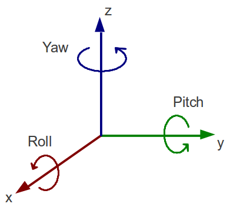

# Interial Measurement with the MPU-6050 Sensor

An inertial measurement unit (IMU) is a device that measures and reports a body's force, angular rate, and orientation, using a combination of accelerometers, gyroscopes, and magnetometers. The accelerometers detect linear acceleration. Gyroscopes measure the rotational (angular) rate. Some IMUs include a magnetometer to provide a heading reference. We refer to a vehicle's axes as roll, pitch, and yaw.

[1](https://xmarklabs.com/wp-content/uploads/2017/04/rollpitchyaw-300x292.png)

 This module focuses on the MPU-6050 sensor as an interial measurement unit. The lessons help us become familiar with the hardware capabilities and configuration. Relative to our self-balancing robot project, this sensor will help the robot maintain an upright position and provide velocity information.

The following sections provide an overview of the MPU-6050 and the lesson series.

 

## MPU-6050 Six-Axis (Gyro + Accelerometer) MEMS MotionTracking Device

"The MPU-6050 devices combine a 3-axis gyroscope and a 3-axis accelerometer on the same silicon die, together with an onboard Digital Motion Processor™ (DMP™), which processes complex 6-axis MotionFusion algorithms. The device can access external magnetometers or other sensors through an auxiliary master I²C bus, allowing the devices to gather a full set of sensor data without intervention from the system processor" [2]

[2]: https://www.invensense.com/products/motion-tracking/6-axis/mpu-6050/

"For precision tracking of both fast and slow motions, the parts feature a user-programmable gyro full-scale range of ±250, ±500, ±1000, and ±2000 °/sec (dps), and a user-programmable accelerometer full-scale range of ±2g, ±4g, ±8g, and ±16g. Additional features include an embedded temperature sensor and an on-chip oscillator with ±1% variation over the operating temperature range." [2]

### MPU6050 used to measure
- Acceleration
- Velocity
- Orientation
- Displacement

### MPU6050 Features
- MEMS 3-axis accelerometer and 3-axis gyroscope
- Power supply: 3 - 5 V
- Communication: I2C protocol
- 16-bit ADC provides high accuracy
- Digital Motion Processor (DMP) provides high computational power
- Can be used to interface with other I2C devices
- Configurable I2C address
- Built-in temperature sensor

### MPU-6050 Pinout

### MPU-6050 Pin Configuration

| Pin Number | Pin Name | Description |
| ------ | ----- | ---------- |
| 1      | Vcc  | Powers module, may be +3V to +5V |
| 2 | Ground | Connect to system ground |
| 3 | Serial Clock (SCL) | I2C communication clock pulse |
| 4 | Serial Data (SDA) | I2C communication data transfer |
| 5 | Auxiliary Serial Data (XDA) | Used to interface other I2C modules with MPU6050, optional |
| 6 | Auxiliary Serial Clock (XCL) | Used to interface other I2C modules with MPU6050, optional |
| 7 | AD0 | Used to vary I2C address |
| 8 | Interrupt (INT) | Interrupt pin to indicate data is available to read |
 
 

### Guides to Accelerometers and Gryoscopes

Before starting the lessons, read the guide to [accelerometers](accelerometer.md) and the guide to [gyroscopes](gyroscope.md) for an overview of their operation.  

## Lessons

The following set of lessons are designed to incrementally introduce the operation and capabilities of the MPU-6050 as an inertial measurement unit.

### Lesson 1 - I2C communication between an Arduino and MPU-6050

- Establish I2C communication between the Arduino Nano and MPU 6050.
- Read MPU 6050 register values upon initial startup
    - Power Mangement 1
        - Is sleep mode turned on?
        - What clock is selected?
 

### Lesson 2 - Default Configuration Register Settings

- Digital Low Pass Filter Configuration
- Accelerometer Full-Scale Configuration
- Gyroscope Full-Scale Configuration
 

### Lesson 3 - Reading Data Measurements

- Power Management 1
    - Disable sleep mode, wake device
- Read and display measurement data
    - Accelerometer
    - Temperature
    - Gyroscope
 

### Lesson 4 - Scaling Acclerometer, Gyroscope, and Temperature Measurements

The measurement register data values must be converted to meaningful units. The gyroscope and accelerometer sensitivity values are used to scale the gyro measurements to degrees/sec and the accelerometer measurements to units of gravity (g). The temperature measurement is converted to degrees C.
 

### Lesson 5 - MyMPU6050 class

The class MyMPU6050 is defined. It contains the functionality implemented in previous lessons and a few new functions for setting configuration registers.

### Lesson 6 - Zero Offset Calibration

When an inertial sensor is at rest, there is often a small offset difference from the expected zero measurement values. This offset is known as sensor bias. The mean sensor bias is calcuated and used to correct measured values.

### Lesson 7 - Real-time Plotting Using FuncAnimation

Accelerometer data updated and plotted in real-time using matplotlib.pyplot.funcanimation.

### Lesson 8 - How fast can we read measurements?

The stated default MPU 6050 sample rates are 1 kHz for the accelerometer and 8 kHz for the gyrosope. This lesson investigates whether or not these rates can be achieved.

### Lesson 9 - Roll, Pitch Angle Estimates Using Accelerometer

The accelerometer's gravity vector is used to estimate roll and pitch angles. 