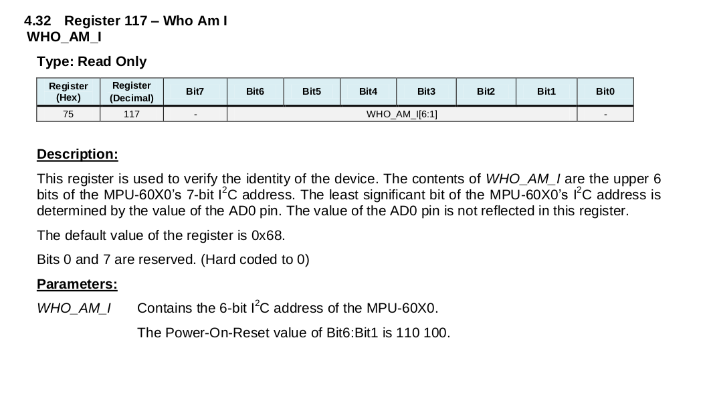
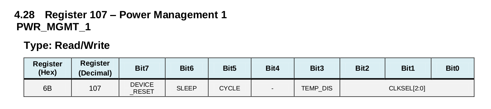
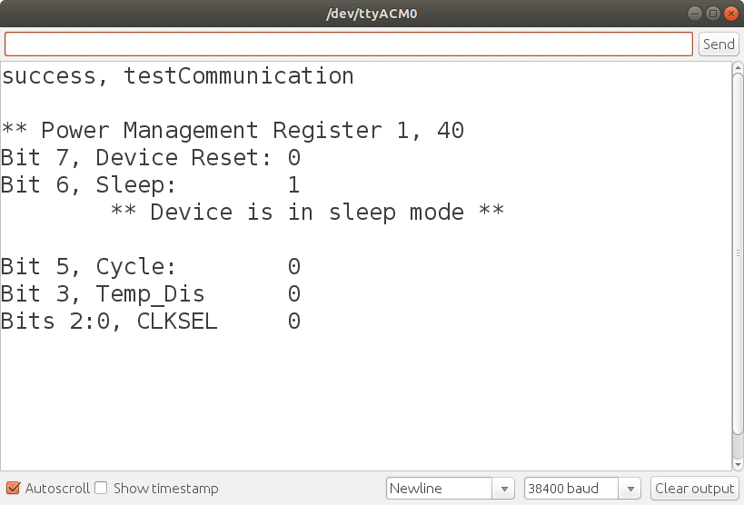
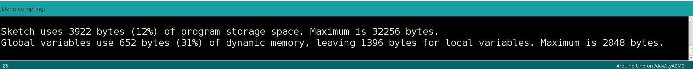

# Lesson 1 - Establishing Arduino Communication with the MPU 6050

## Arduino - MPU 6050 I2C Wiring

<p>The Arduino Nano's I2C pins are A5 (SCL) and A4 (SDA). The MPU 6050's SCL pin is directly wired to the Arduino's SCL line. The two SDA lines are directly wired together as shown in the image below.</p>
<p>The MPU 6050 board is 5V tolerant, with an on-board voltage regulator. Connect the Arduino 5V pin to the MPU 6050 5V pin. Connect the Arduino ground (GND) to the MPU 6050 ground.</p>
<br><br>

<br>

[1] https://howtomechatronics.com/wp-content/uploads/2019/04/Arduino-and-MPU6050-Circuit-Diagram-768x400.png
<br>
<br>

## Lesson 1 Arduino Sketch

### Objectives
- Establish I2C communication between the Arduino Nano and MPU 6050.
- Read MPU 6050 register values upon initial startup
    - Power Mangement 1
        - Is sleep mode turned on?
        - What clock is selected?
<br>

### Program Files

Lesson 1 contains one source code file <br>
    - [lesson1](./lesson1.ino)<br>
    

<p>There are Arduino libraries written for the MPU 6050. Learning to use the MPU 6050 requires studying its data sheet and register documentation to understand its capabilities whether you write your own software or use an existing library. This lesson takes the approach of writing our own source code to interface with the MPU 6050.</p>


1. **included files** 

```
#include <Ardunio.h>
#include <Wire.h>
```

<p>To use the Arduino libraries, when writing a program in the int main function form, the header file must be included. It is included by default when using the Arduino sketch setup and loop default form.</p>
<p>Arduino's Wire library makes it very easy to communicate on the I2C bus. The Arduino can be configured as a master or as a slave. The Arduino will be configured as a master when interfaced with the MPU 6050 sensor. To use the Wire library, it must be included in the program</p>
<br>
<br>

2. **MPU-6050 I2C Interface**

The [datasheet](../datasheet/MPU-6000-Datasheet.pdf), section 9.2, provides information about the I2C interface.</p>

- MPU-6050 always operates as a slave device to system processor
- Slave address b110100X
    - 7 bits long, LSB of address determined by logic level on pin AD0
        -AD0 low, address b1101000 (default address)
        -AD0 high, address b1101001
- Maximum bus speed is 400 kHz.
<br>
<p>We will connect the AD0 pin to ground to put it in a low state and use the address b1101000.</p><br> 

The MPU-6050 [register map](../datasheet/MPU-6000-Register-Map.pdf) map description provides the register addresses, names of the bit fields, and a description of their purpose and allowable configuration.

A few macros are defined to provide the register addresses and I2C address.</p>

```
// MPU 6050 macro definitions from 
// MPU-6000 and MPU-6050, Register Map and Descriptions, Revision 4.2, 8/19/13
// MPU-6000/MPU-6050 Product Specification, Revision 3.4, 8/19/13

// MPU 6050 I2C address
#define MPU6050_ADDRESS_AD0_LOW     0x68   // i2c address pin low (GND), default


// MPU 6050 register addresses
#define MPU6050_RA_PWR_MGMT_1   0x6B
#define MPU6050_RA_WHO_AM_I     0x75  
```
<br>

3. **main function** 
<p>The init() function is an Arduino defined function that configures timers and other hardware. Serial and I2C communication are initiated next.</p>
<p>The testConnection function is a convenient way to verify I2C communication between the Arduino and MPU6050 is working. If working, the testConnection function returns a value of true.</p>
<p>After communication is verified, the printPowerState function is called to display power management register settings.</p> 

```
int main(void)
{
  init();
  Serial.begin(38400);
  Wire.begin();                 // Initiate Wire library, join I2C bus as master
  delay(100);

  if(testCommunication(MPU6050_ADDRESS_AD0_LOW) == true)
  {
    printPowerState(MPU6050_ADDRESS_AD0_LOW);
  }

  while(1);
  return 0;
}
```
<br><br>

4. **testConnection()**
<p>The Who_Am_I register is used to verify device identity. The register is read only, containing the upper six bits of the 7-bit I2C address.</p>

- Bits 7 and 0 are hard-coded to 0
- Bits 6:1 110 100

<p>Querying this register and comparing the byte value read confirms that the Arduino and MPU-6050 are able to communicate via I2C. Note that the value of the AD0 pin is not reflected in this register</p>

>Note: Some units return 0x72 instead of the expected 0x68. Run the code as is. If your unit returns 0x72, you still have managed to connect to the board via I2C, else you would not be able to read either the 0x68 or 0x72 from the register. (Date: 9/16/2020)
<br><br>

<br><br>

```
bool testCommunication(uint8_t devAddr)
{
  uint8_t state;
  state = readByte(devAddr, MPU6050_RA_WHO_AM_I);
  if(state == 0x68){
    Serial.println("success, testCommunication\n");
    return true;
  }
  else{
    Serial.print("error, testCommunication, expected: 0x68, regVal: ");
    Serial.println(state,HEX);
    return false;
  }
}
```

</br></br>

5. **readByte()**

<p>The readByte function illustrates the required sequence of I2C function calls to read the contents of an MPU-6050 register.</p>


```
uint8_t readByte(uint8_t devAddr, uint8_t regAddr)
{
  uint8_t data;
  Wire.beginTransmission(devAddr);
  Wire.write(regAddr);
  Wire.endTransmission(false);            // send TX buffer, send restart to keep connection alive
  Wire.requestFrom(devAddr, (uint8_t)1);  // request 1 byte, default true sends stop message after request,
                                          // releasing i2c bus
  data = Wire.read();
  return data;
}
```

</br></br>

6. **reportPowerState()**
<p>This function queries the MPU 6050 power management 1 register. Page 8, of the register map, indicates the reset value is 0x00 for all registers other than<br>
- Register 107: 0x40<br>
- Register 117: 0x68<br>

<p>Register 117 is the WhoAmI register that was queried by the testConnection function. Register 107 is called power management 1. Assuming that reset occurs after a power off state, let's see if the power management register's bit values are 0x40.</p>

The [register map](../datasheet/MPU-6000-Register-Map.pdf), section 4.28, describes the power registers. By default, the MPU 6050 starts out in sleep mode, requiring you to wake it up by setting the sleep bit to zero.
<br>


<br>


- DEVICE_RESET
    - When set to 1, this bit resets all internal registers to their default values.
    - The bit automatically clears to 0 once the reset is done.
- SLEEP 
    - When set to 1, this bit puts the MPU-60X0 into sleep mode.
- CYCLE 
    - When this bit is set to 1 and SLEEP is disabled, the MPU-60X0 will cycle between sleep mode and waking up to take a single sample of data from active sensors at a rate determined by LP_WAKE_CTRL (register 108.
- TEMP_DIS 
    - When set to 1, this bit disables the temperature sensor.
- CLKSEL 3-bit unsigned value. Specifies the clock source of the device.
    - Clock source settings shown below
<br>
<br>

```
void reportPowerState(uint8_t devAddr)
{
  uint8_t state;
  state = readByte(devAddr, MPU6050_RA_PWR_MGMT_1);
  Serial.print("** Power Management Register 1, ");
  Serial.println(state,HEX);
  Serial.print("Bit 7, Device Reset: ");
  Serial.println(state >> 8, HEX);
  Serial.print("Bit 6, Sleep:        ");
  Serial.println( (state & 0x40) >> 6, HEX);
  if( (state & 0x40) >> 6 == 1)
  {
    Serial.println("\t** Device is in sleep mode **\n");
  }
  Serial.print("Bit 5, Cycle:        ");
  Serial.println( (state & 0x20) >> 5, HEX);
  Serial.print("Bit 3, Temp_Dis      ");
  Serial.println( (state & 0x08) >> 3, HEX);
  Serial.print("Bits 2:0, CLKSEL     ");
  Serial.println( (state &0x07), HEX);
  Serial.println("");
}
```


7. **Program Output**

Before running the program, the device was powered off and then back on. Study the output as it relates to the register settings. The output below shows communication was successful and the sleep bit in the power managment 1 register was set to 1 as expected. We have confirmed the two registers match their expected state values when powering on.<br>

<br><br>

### Reducing Global Variables Dynamic Memory Usage

Note that 31% of dynamic memory is used by global variables. Based on the discussion in Arduino Nano [optimizing arduino code memory](../../arduino_nano/optimizing_arduino_code_memory.md) lesson, what should be done to reduce the amount of memory the constant strings require?<br>


<br>


### Conclusion

This lesson established I2C communication between an Arduino and the MPU-6050. The state of the power management 1 register was displayed. Lesson 2 builds upon this program, reading and reporting the device configuraton state.<br>
