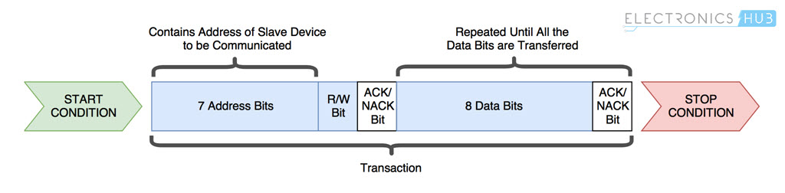

# I2C Communication 

The MPU 6050 communicates with the Arduino through the I2C (inter-integrated circuits) protocol. I2C is a synchronous, serial communication protocol, developed by Philips Semiconductors for the transfer of data between a central processor and multiple ICs on the same circuit board, using just two common wires. 

## Features

- Only two common bus lines (wires) are required to control any device 
- No need of prior agreement on data transfer rate like in UART communication. Data transfer speed can be adjusted whenever required.
- 7-bit addressing system to target a specific device
 

## Physical I2C Bus

There two interface wires are the Serial Clock Line (SCL) and the Serial Data Line (SDA). Data is transferred through the SDA wire and is synchronized with the clock signal SCL. All I2C network devices are connected to the same SCL and SDA line as shown below.
   

 

[1] https://www.electronicshub.org/wp-content/uploads/2018/02/Basics-of-I2C-Communication-Masters-Slaves.jpg  

## Master and Slave Devices

The devices are categorized as either masters or slaves. Only one master stays active on the I2C bus at any one time. The master controls the SCL clock line and decides what operation is performed on the SDA line.

Multiple slave devices can be connected to te same I2C bus, each with a unique permanent 7-bit address. When a master wants to transfer data to or from a slave device, it specifies the slave address. Other slave devices on the same bus do not respond unless their address is specified by the master device. 

## I2C Speeds

The original I2C specification had a maximum speed of 100 KHz (kbits/sec). Most applications still use this speed, as it is sufficient for transferring data from sensors.

I2C has other higher speed modes, but not all devices support them.
- Fast Mode - maximum clock frequency of 400 kHz.
- Hi-Speed Mode - maximum clock frequency of 3.4 MHz
- Ultra-Fast Mode - maximum clock frequency of 5 MHz 

## I2C Limitations

- Not particularly fast
- Can only be used over short distances.
    - Maximum distance decreases as speed increases
    - At 100 kHz, max distance is about 1 meter 

## Data Transfer Protocol

Data is transferred between the master device and slave devices through a single data line, via a specific patterned bit sequence. Each bit pattern sequence is termed a transaction and structured as shown below. 

1. Master sends start condition and controls the clock signal.
2. Master sends a unique 7-bit slave device address
3. Master sends read/write bit 
    - 0 slave receive
    - 1 slave transmit
4. Slave with matching 7-bit device address always sends acknowledgement bit (ACK)
5. Transmitter (slave or master) transmits 1 byte of data
6. Receiver issues an ACK bit for the byte received
7. Repeat 5 and 6 for multiple byte transmissions
8. Master always sends stop condition
 
 

 

[2] https://www.electronicshub.org/wp-content/uploads/2018/02/Basics-of-I2C-Communication-Data-Transfer-Protocol.jpg 
 
 
