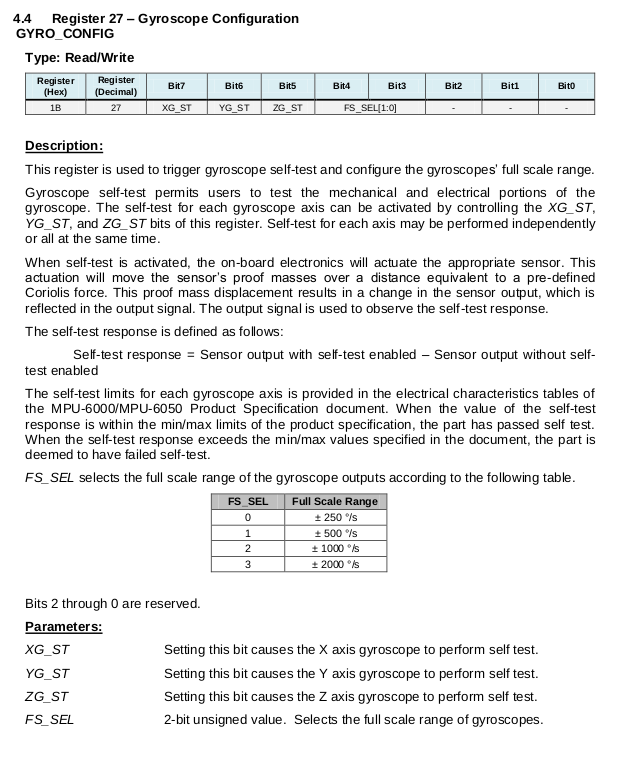

# Lesson 2 - Power On Default Configuration

<p>Lesson 2 builds upon lesson 1. Additional functions are added to read the device configuration settings after the devices powers on.</p>

## Objectives
- Read the configuration register settings
    - Power Mangement 1
        - Is sleep mode turned on?
        - What clock is selected?
    - Configuration
        - Is external frame synchronization turned off?
        - What is the digital low pass filter configuration?
            - Acclerometer bandwidth, sample rate
            - Gyroscope bandwidth, sample rate
    - Acceleration Configuration
        - Is the self-test disabled?
        - What is the full scale range?
    - Gyroscope Configuration
        - Is the self-test disabled?
        - What is the full scale range?

<br>
<br>

### Program Files

Lesson 2 contains one source code file <br>
    - [lesson2](../lesson2/lesson2.ino)<br>

### Define Configuration Register Macros

Three additional registers are queried in this program. The macros defining their addresses and settings are shown below.

```
#define MPU6050_RA_CONFIG       0x1A
#define MPU6050_RA_GYRO_CONFIG  0x1B
#define MPU6050_RA_ACCEL_CONFIG 0x1C

// MPU 6050 Clock Settings
#define MPU6050_CLOCK_PLL_XGYRO 0x01

// MPU gyro full scale range settings 
#define MPU6050_GYRO_FS_250  0x00
#define MPU6050_GYRO_FS_500  0x01
#define MPU6050_GYRO_FS_1000 0x02
#define MPU6050_GYRO_FS_2000 0x03

// MPU accel full scale settings 
#define MPU6050_ACCEL_FS_2G  0x00
#define MPU6050_ACCEL_FS_4G  0x01
#define MPU6050_ACCEL_FS_8G  0x02
#define MPU6050_ACCEL_FS_16G 0x03
```
<br>
<br>

### reportConfigState()

The [register map](../datasheet/MPU-6000-Register-Map.pdf), section 4.3, describes the configuration register. It configures the external Frame Synchronization (FSYNC) pin sample and the Digital Low Pass Filter (DLPF) setting for both the gyroscopes and accelerometers. It is expected that the EXT_SYNC_SET bits will be zero for external frame synchronization and the DLPF bits will be zero as well.<br>

<br>

### reportGyroConfigState()

The [register map](../datasheet/MPU-6000-Register-Map.pdf), section 4.4, describes the gyroscope configuration register. It configures the gyroscope self-test bits and the full scale range. It is expected that all register bits will be zero, turning off the self-test and selecting the full-scale range as 250&deg;/s.
<br>

<br>

### reportAccelConfigState()

The [register map](../datasheet/MPU-6000-Register-Map.pdf), section 4.5, describes the gyroscope configuration register. It configures the accelerometer self-test bits and the full scale range. It is expected that all register bits will be zero, turning off the self-test and selecting the full-scale range as +-2g.
<br>

<br>

### Program Output

The program output confirms the MPU-6050 configuration states after power on, match the default settings listed in the register map. <br>

<br>

### Conclusion

We are now familiar with the power on device configuration, have some understanding of how to read registers and extract their bit field values. In a future lesson, we will experiment with changing the configuration settings. Next, lesson 3 illustrates how to wake the device and read data measurement values.<br>

