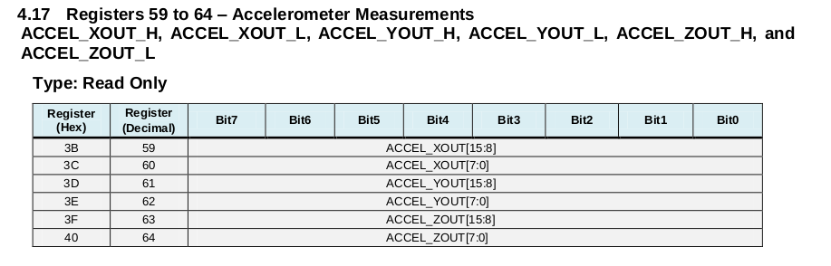
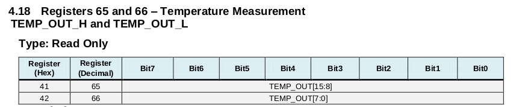
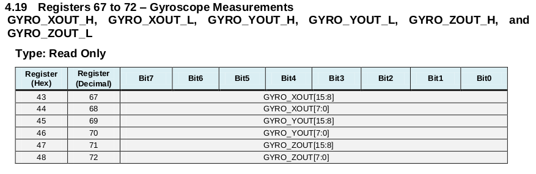
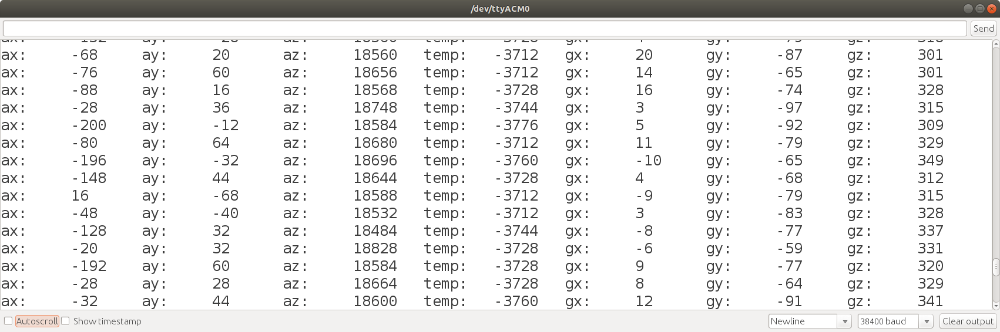

# Lesson 3 - Reading Data Measurements

Lesson 3 

## Objectives
- Power Management 1
    - Disable sleep mode, wake device
- Read and display measurement data
    - Accelerometer
    - Temperature
    - Gyroscope
<br>
<br>

### Program Files

Lesson 3 contains one source code file <br>
    - [lesson3](../lesson3/lesson3.ino)<br>

### Disable Sleep Mode

In lessons 1 and 2, we observed that the device is in sleep mode, immediately after it powers on. To wake the device, the bit is set to zero. In the code below, every bit in the power management 1 register is set to zero. This is safe in terms of our simple program flow. All bits, except the sleep bit, are set to 0 initially, so the only state we change is the sleep mode.

```
Wire.beginTransmission(MPU6050_ADDRESS_AD0_LOW);
Wire.write(0x6B);                       // power management 1 register
Wire.write(0);                          // setting bit 6 to zero, wakes up device
                                        // setting other bits to zero turns off reset
                                        // and uses internal oscillator as clock
Wire.endTransmission(true);
```

### Accelerometer Measurements

The [register map](../datasheet/MPU-6000-Register-Map.pdf), section 4.17, describes the Accelerometer Measurements registers. The most recent acclerometer measurement is stored as a 16-bit 2's complement value. Data is written at the sample rate defined in register 0x19, the Sample Rate Divider. In the default mode, the acclerometer rate is 1 kHz.

Each 16-bit value is stored in two 8-bit registers, as shown in the register table below.

<br>


### Temperature Measurement

The [register map](../datasheet/MPU-6000-Register-Map.pdf), section 4.18, describes the Temperature Measurement registers. The most recent temperature sensor measurement is stored as a 16-bit signed value. Data is written at the sample rate defined in register 0x19, the Sample Rate Divider.

<br>


### Gyroscope Measurements

The [register map](../datasheet/MPU-6000-Register-Map.pdf), section 4.19, describes the Gyroscope Measurements registers. The most recent temperature sensor measurement is stored as a 16-bit 2's complement value. Data is written at the sample rate defined in register 0x19, the Sample Rate Divider. In the default mode, the gryo rate is 8 kHz.

<br>


### Reading the data and forming 16 bit integers

The signed 16-bit integer variables ax, ay, az, temp, gx, gy, and gz will store the measurements. The program requests reading 14 bytes, starting at regiser 0x3B. The accelerometer, temperature, and gyroscope measurement registers are in contiguous memory, starting at register 0x3B and ending at register 0x48.

Forming the 16-bit value from two 8-bit bytes requires shifting the higher order byte to the left by 8 bits and then ORing the low order byte, as shown in the code below.

```
  int16_t ax, ay, az, temp, gx, gy, gz;
  
  while(1)
  {
    // read data from registers
    Wire.beginTransmission(MPU6050_ADDRESS_AD0_LOW);
    Wire.write(0x3B);                     // start reading register 0x3B (ACCEL_XOUT_H)
    Wire.endTransmission(false);
    Wire.requestFrom(MPU6050_ADDRESS_AD0_LOW, 14);  // request reading 14 bytes
    ax = Wire.read() << 8 | Wire.read();    // reads 0X3B (ACCEL_XOUT_H) and 0x3C (ACCEL_XOUT_L)
    ay = Wire.read() << 8 | Wire.read(); 
    az = Wire.read() << 8 | Wire.read(); 
    temp = Wire.read() << 8 | Wire.read(); 
    gx = Wire.read() << 8 | Wire.read(); 
    gy = Wire.read() << 8 | Wire.read(); 
    gz = Wire.read() << 8 | Wire.read(); 
```


### Program Output

The program output shows measurement values of the board statically at rest. It is expected that the x,y acceleration would be zero, with the z acceleration equal to 1g. It is also expected that the gyroscope angular rotation values would be zero as well. here is some bias error that must be removed through calibration to produce the expected values. Additionally, these numbers have no meaning in terms of m/s<sup>2</sup> or &deg;/s because we have not yet applied the scaling factors.<br>

<br>

### Conclusion

We have succeeded in reading sensor data measurements, but now need to learn how to scale the data and calibrate the sensors to remove the bias. Next, lesson 4 will demonstrate how to scale the data.<br>
