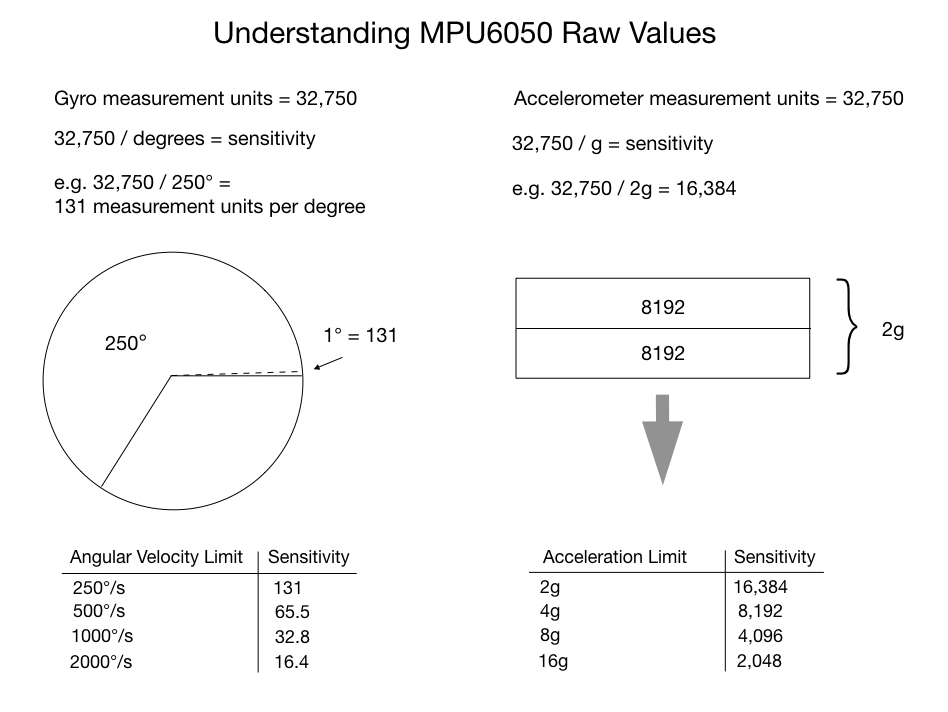

# Lesson 4 - Scaling Acclerometer, Gyroscope, and Temperature Measurements

<b>Objective</b>: Scale data measurements into meaningful units.
 

## Accelerometer and Gyroscope Sensitivity

The sensitivity values in the table below are used to scale the data measurements.  The gyroscope provides an measurement angular speed, degrees/sec. The gyro <b><i>sensitivity</i></b> is given in units of lsb per degree per second, meaning how many bits change with each degree/sec change. The accelerometer provides a measurement in terms of gravity, where 1 g is 9.81 m/s2. The accelerometer <b><i>sensitivity</i></b> LSB/g is the number of bits that change with 1 g change.

The sensitivity values are dependent on the full scale range setting.

| Gyro Full Scale Range | Gyro Sensitivity | Gyro Rate Noise | Accel Full Scale Range | Accel Sensitivity |
| --- | --- | --- | --- | --- |
| (&deg;/sec) | (LSB/&deg;/sec) | dps/sqrt(Hz) | (g) | LSB/g |
| +- 250 | 131 | 0.0005 | +-2 | 16384 |
| +- 500 | 65.5 | 0.0005 | +-4 | 8192 |
| +- 1000 | 32.8 | 0.0005 | +-8 | 4096 |
| +- 2000 | 16.4 | 0.0005 | +-16 | 2048 |

 

### Sensitivity is based on bit resolution

The sensitivity values are based on the internal 16-bit analog to digital converter (ADC) hardware. The example below illustrates how these measurements were determined. 

Gyro Full Scale Range +-250 &deg;/sec  
Gyro Sensitivity 131 LSB/&deg;/sec  

The gyro measurements are 16 bit values, allowing for 216 or 65,535 unique binary numbers. The binary numbers represent signed decimal values, with a range of [- 32768, +32767].  

A range of +-250 represents 501 unique integer values. 65535 / 501 = 130.8 which corresponds to the resolution of 131 LSB/&deg;/sec.

## Scaling Accelerometer and Gryoscope Data Measurements by Sensitivity

The data read from the sensor's measurement registers is in binary form. Think of this as the LSB unit. To scale the accelerometer and gyroscope measurements, simply divide them by their sensitivity factors.

gyro data (LSB) / gyro sensitivity (LSB/&deg;/sec) = gyro data (&deg;/sec)

accel data (LSB) / accel sensitivity (LSB/g) = accel data (g)

## Converting Temperature Data

The formula for converting the temperature measurement, section 4.18, [register map](../datasheet/MPU-6000-Register-Map.pdf).

Temperature in degrees C = (temperature register value / 340) + 36.53
  

## Summary - Understanding Raw Values
 

 [1](https://mjwhite8119.github.io/Robots/assets/images/Control-Theory-Slides.021.jpeg)
  

## Student Exercise

Add functionality to the previous lesson's Arduino program to convert the values read from the acclerometer, gyro, and temperature measurement registers, using the sensitivity scaling and given formulas.

Use the Serial library to print the scaled values and their units.