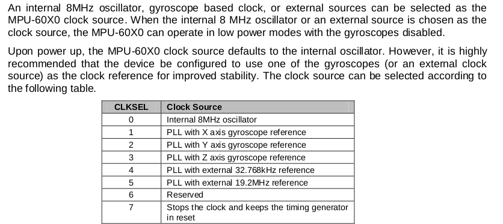
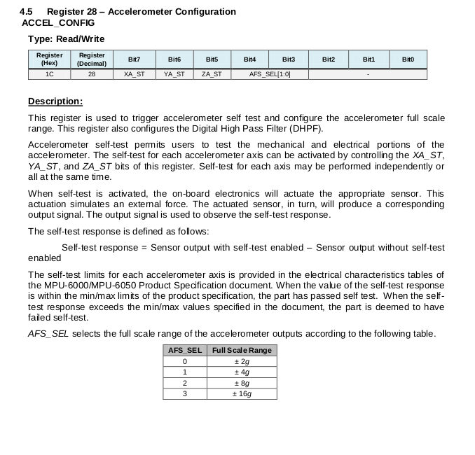

# Lesson 5 - Defining MyMPU6050 class and report functions

The class MyMPU6050 is defined with all of the functionality from previous lessons.

### Program Files

Lesson 5 contains three source code files  
    - [lesson5](../lesson5/lesson5.ino) 
    - [mympu6050.h](../lesson5/mypu6050.h) 
    - [mympu6050.cpp](../lesson5/mympu6050.cpp) 
    - [report.h](../lesson5/report.h) 
    - [report.cpp](../lesson5/report.cpp) 

## Lesson 5 Arduino Sketch

### Objectives
- Establish I2C communication between the Arduino Nano and MPU 6050.
- Read MPU 6050 register values after initialization
    - Power Mangement 1
        - Is sleep mode turned on?
        - What clock is selected?
    - Configuration
        - Is external frame synchronization turned off?
        - What is the digital low pass filter configuration?
            - Acclerometer bandwidth, sample rate
            - Gyroscope bandwidth, sample rate
    - Acceleration Configuration
        - Is the self-test disabled?
        - What is the full scale range?
    - Gyroscope Configuration
        - Is the self-test disabled?
        - What is the full scale range?

### lesson5.ino

This example creates an MyMPU6050 object, initializes the sensor, displays information about its configuration state, and then displays data measurements.

### MyMPU6050.h

This file defines macros for some of the register addresses and configuration settings. The class MyMPU6050 is declared.

### MyMPU6050.cpp

The class functions are defined here. Read through the function comments to understand their usage.

### report.h, report.cpp

These are some helper functions to print information.

**reportPowerState()**

This function queries the MPU 6050 power management 1 register. Page 8, of the datasheet, indicates the reset value is 0x00 for all registers other than 
- Register 107: 0x40 
- Register 117: 0x68 

The [register map](../datasheet/MPU-6000-Register-Map.pdf), section 4.28, describes the power registers. By default, the MPU 6050 starts out in sleep mode, requiring you to wake it up by setting the sleep bit to zero.
 

 

- DEVICE_RESET
    - When set to 1, this bit resets all internal registers to their default values.
    - The bit automatically clears to 0 once the reset is done.
- SLEEP 
    - When set to 1, this bit puts the MPU-60X0 into sleep mode.
- CYCLE 
    - When this bit is set to 1 and SLEEP is disabled, the MPU-60X0 will cycle between sleep mode and waking up to take a single sample of data from active sensors at a rate determined by LP_WAKE_CTRL (register 108.
- TEMP_DIS 
    - When set to 1, this bit disables the temperature sensor.
- CLKSEL 3-bit unsigned value. Specifies the clock source of the device.
    - Clock source settings shown below
 
 

  

**reportConfigState()**

The [register map](../datasheet/MPU-6000-Register-Map.pdf), section 4.3, describes the configuration register. It configures the external Frame Synchronization (FSYNC) pin sample and the Digital Low Pass Filter (DLPF) setting for both the gyroscopes and accelerometers. It is expected that the EXT_SYNC_SET bits will be zero for external frame synchronization and the DLPF bits will be zero as well.
 

 

**reportGyroConfigState()**

The [register map](../datasheet/MPU-6000-Register-Map.pdf), section 4.4, describes the gyroscope configuration register. It configures the gyroscope self-test bits and the full scale range. It is expected that all register bits will be zero, turning off the self-test and selecting the full-scale range as 250&deg;/s.
 

 

**reportAccelConfigState()**

The [register map](../datasheet/MPU-6000-Register-Map.pdf), section 4.5, describes the gyroscope configuration register. It configures the accelerometer self-test bits and the full scale range. It is expected that all register bits will be zero, turning off the self-test and selecting the full-scale range as +-2g.
 

 
