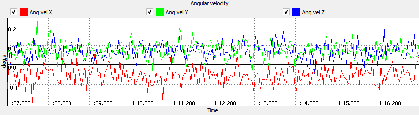
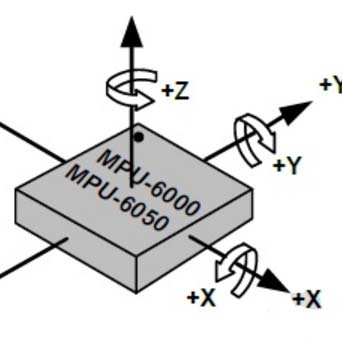
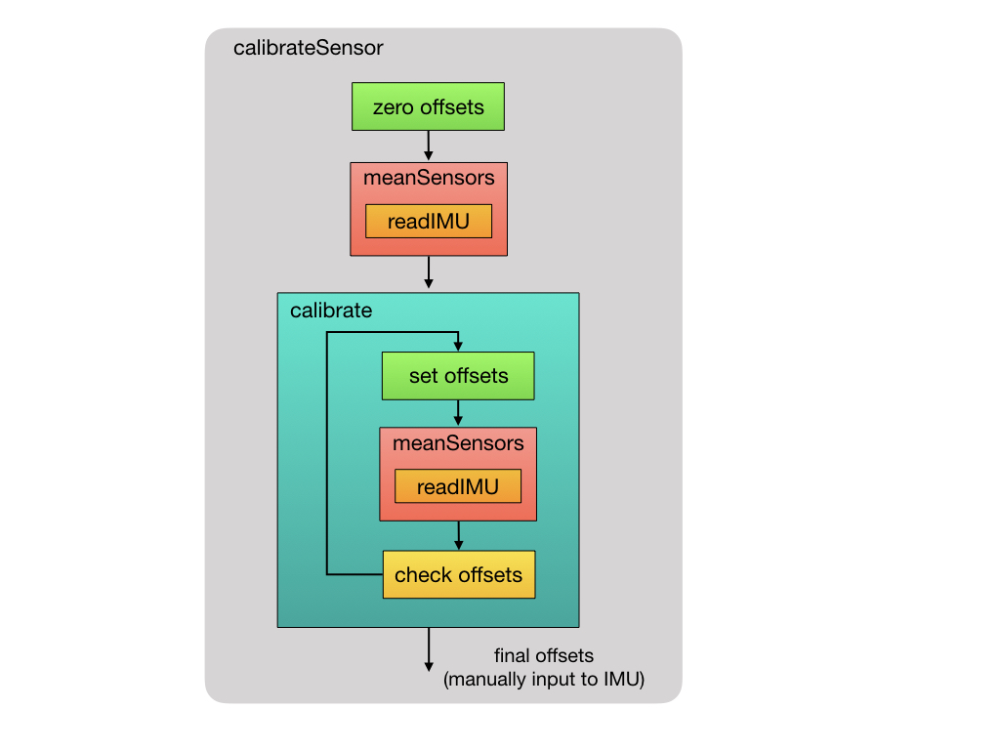

# Lesson 6 - Calculating Sensor Bias Offset

When an inertial sensor is at rest, there is often a small offset difference from the expected zero measurement values. This offset is known as sensor bias. The image below shows measurements from a gyroscope at rest, illustrating this device's sensor bias.



## Sensor Bias 

The bias of a rate gyro is the average output when the device is sitting still. When the gryo is not moving, we expect its output to be zero (i.e. rotation is 0 degrees/sec). However, there is often a small offset in the average signal output, which is known as sensor bias. 

Sensor bias is caused by changes in physical properties over time. The physical property of each sensor is different, so they must each be individually calibrated to correct for the bias. Because the bias changes over time, sensors must be regularly calibrated.

You can find the constant bias (offset) error of a gyro by taking the average of the output over a long period of time while the device is not rotating. Once you know the constant bias you can subtract it from subsequent measurements to eliminate this form of error.

The accelerometer bias is calculated by placing the device on a flat surface, where it measures 0g on the X and Y axis and +1g on the Z axis. The offset is calculated in the same manner, by taking the average of the output over a long period of time while the device is not moving.</br></br>


</br></br>

## MPU Hardware Offset Registers Application Note

The [MPU Hardware Offset Registers Application Note](../datasheet/invensense-hardware-offset-registers.pdf) provides some information about finding the offset biases for the accelerometer and gyroscope, as well as the gyro and accelerometer offset registers. Section 3 indicates the hardware offset registers can be used for offset cancellation when not using the DMP (Digital Motion Processor) algorithms. Note: We are not using the DMP.

When using the offset registers, all data from the MEMS sensors will have the stored offset values applied before outputting to the data registers for users to read. All data in the FIFO, output registers and used in the DMP will already have these offsets included.

## Calculating the Offset Biases

Place the sensor on flat surface in a level position. With the Z-axis pointing into the flat surface, the expected accelerometer measurement is 16384 (1g). The expected accelerometer X and Y axis measurements are zero. The device must be stationary so that the expected gyro output of each axis will be zero. 

Sampling measurements from each axis, we will be able to determine the average offset from the ideal values and use those average values as the offset biases.

## Acceptable Error

How many samples do we need to determine the offset bias? Suppose we choose 1000 samples and calculate average offset values. What is the error of these offset values?  Are these errors acceptable? What is our acceptable error level? 

Let's assume the accelerometer and gyroscope are set to their most sensitive configuration of +-2g (16384 LSB/g) and +-250 &deg;/sec (131 LSB/&deg;/sec). For the gyro, is 1 &deg;/sec acceptable? Integrating angular rotation for one axis, with an error of 1 &deg;/sec might result in an error of 60 degrees. Is 0.1 &deg;/sec acceptable? Over 60 seconds, that's a much smaller error of 6 degrees, but that error only continues to grow over time.

Realistically, we cannot reduce the bias error to zero, but let's see how small a value we can achieve. We will use the calibration process Luis Rodenas implemented in his MPU6050_calibration.ino program. (https://github.com/ezgode/Arduino_MPU6050/blob/master/Ardu_Sketches/MPU6050_calibration/MPU6050_calibration.ino) This example is widely referenced as a working calibration method.


```
int acel_deadzone=8;     // Acelerometer error allowed, make it lower to get more
                         // precision, but sketch may not converge  (default:8)

int giro_deadzone=1;     // Giro error allowed, make it lower to get more precision, 
                         // but sketch may not converge  (default:1)
```

The errors are based on sampling measurements with the accel and gyro configured at their most sensitive configurations of +-2g (16384 LSB/g) and +-250 &deg;/sec (131 LSB/&deg;/sec), respectively.<br>
- 8/16384 is approximately 0.00049 g
- 1/131 is approximately 0.0076 &deg;/sec<br><br>

## Calibration Algorithm

The image below illustrates the calibration process.<br>
- Zero Offsets
    - The accelerometer and gyro offset registers are set to zero. 
- meanSensors
    - Read 1000 measurements
    - calculate the average offset values
- Calibrate 
    - Set total calibrated value to zero
    - Set offsets
        - Store the most recently calculated offset values in the offset registers
    - meanSensors 
        - Read 1000 measurements
        - calculate the average offset values
    - check offsets
        - Compare the newly found average offset values to the required offset tolerance
            - if the absolute value(newly calculated mean) is less than or equal to the deadzone tolerance, add 1 to total calibrated
                - For accel z, absolute value(16384 - newly calculated mean)
            - else update the offset value
                - updated offset = previous offset + (desired measurement value - mean offset) / deadzone
            - Note: In all cases, except one, the desired measurement value is zero.
            The z axis gravity has a desired measurement value of 16384 for full sensitivity. 
    - continue the calibrate processs until the offset values converge to the desired tolerance, i.e. the ready total is six.
- Final Offsets
    - Ensure the offset registers contain the final offset value calculated
    - Record the final offset values. The calibration process takes some time to complete. You will not want to run this every time your robot restarts. Recording and storing the offset values in your program will allow you to load the offsets in the registers whenever your robotic application program starts.
    
</br>

 [2](http://mjwhite8119.github.io/Robots/assets/images/Control-Theory-Slides.025.jpeg)
<br>
<br>

## Sensor Configuration Settings

**Clock Source** - set the clock source to the same that will be used when the sensor is functioning as an IMU. The power management 1 register information suggests setting the clock source to PLL with x-axis gyroscope reference (or one of the other other axes).

**Configuration** Set the digital low pass filter
**Accelerometer Configuration** - Set the full scale range to +- 2g, its most sensitive range. The self-test bits should be turned off.

**Gyroscope Configuration** - Set the full scale range to +- 250&deg;/sec, its most senstive range. The self-test bits shoud be turned off.

```
mpu.reset();
mpu.setClockSource(0x01);      // PLL with reference to x-axis gryo
mpu.setFullScaleAccelRange(0); // +-2g
mpu.setFullScaleGyroRange(0);  // +- 250 deg/sec
mpu.setSleepEnabled(false);    // wake up
delay(100);                    // need to wait for PLL to be established?
```

## Accel & Gyro Offset Registers

**Gyro Offset Registers**

<p>The Gyro registers at boot up will have a default value of 0. The value of the bias input needs to be in +-1000dps sensitivity range. This means each 1 dps = 32.8 LSB</p>

**Accelerometer Offset Registers**

1. Initial values contain the OTP values of the Accel factory trim. Therefore at bootup there will be a non-zero value in these registers. Users will need to first read the register and apply the biases to that value.<br>
2. Format is in +-8G in which 1mg = 4096 LSB <br>
3. Bit 0 on the low byte of each axis is a reserved bit and needs to be preserved.
</br></br>

## Calculating Mean Offset Values

1. Read 100 measurements and disregard them
2. Read 1000 measurements and calculate their sum. Don't forget to wait between readings to ensure you are not reading the same value multiple times. The delay is based on the sensor's sample rate configuration.
3. Find the mean value of the sample by dividing the sum by 1000.

<p>It is a common practice to read and throw away several measurements, such as the first 100, to allow the device to stabilize. Why 100? Internet forum & blog posts advise this. In terms of credible advice, the MPU-6050 has been on the market for several years and widely used, making it a good starting point.</p> 

<p>Is there anything in the device data sheets or register descriptions that supports this? Not that I have directly found.</p>
</br></br>

## Storing Offset Values: Registers or Program Variables

<p>We have two options for storing the offsets: (a) sensor offset storage registers, or (b) as program variables.</p>
<p>The storage register advantage is that the offset will be automatically applied before to the data measurement. We calculate the offset, store it, and do not need to handle it elsewhere in the program. The storage register disadvantage is the accelerometer offset needs some special handling of the temperature offset stored in the low order bytes. This requires some bit shifting and masking when working with this register's data. </p>
<p>The program variable option is the conceptually easier to program solution, but requires our program to apply the offset to measurements after reading them.</p>
</br></br>

## Calibration Function - Offsets as Program Variables

### Error Tolerance Declaration

The routine's objective is to converge to a set of offset values that converge to an acceptable error tolerance. Earlier, we defined the followed as acceptable error levels:</br>

- 8/16384 is approximately 0.00049 g </br>
- 1/131 is approximately 0.0076 &deg;/sec</br>

In practice, when testing the algorithm, make the error tolerances larger, so that the algorithm will converge fairly quickly. Once your code is converging, then begin making the tolerance smaller to find an acceptable error level that converges to a solution.
</br></br>

### Offset Calculation

- Offset = Desired Value - Mean Measured Value</br>
    Example: Gyro X axis desired value is 0 deg/sec
    Gyro X axis mean measured value is 87
    Offset = 0 - 87 = -87

</br></br>

## Student Exercise

Implement and test the calibration function. Add the needed functions to the MyMPU6050 class.
