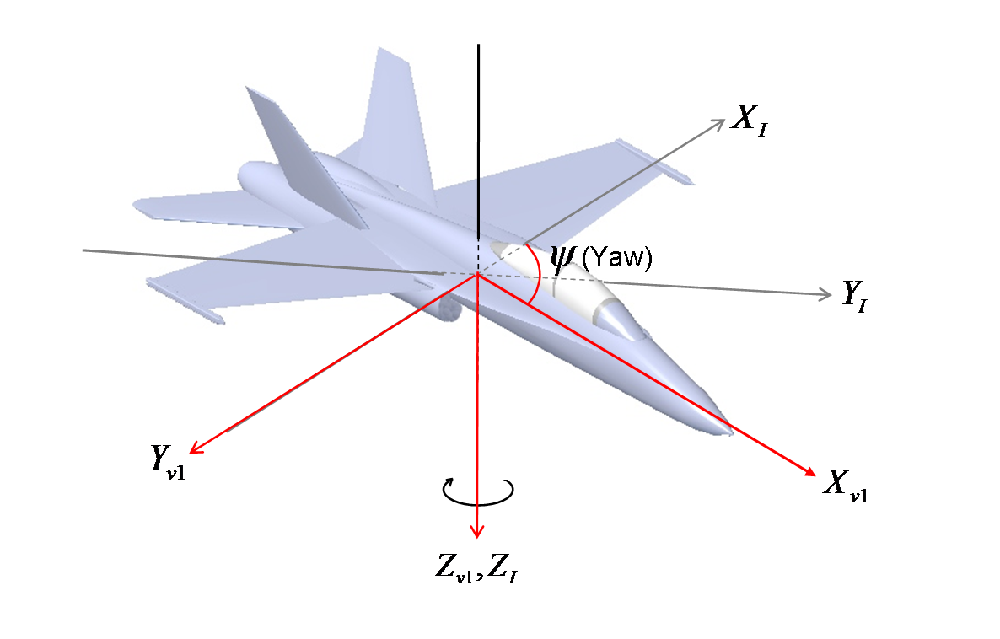
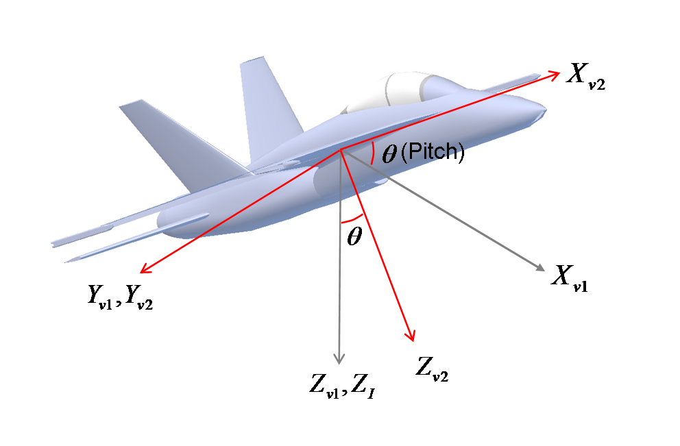
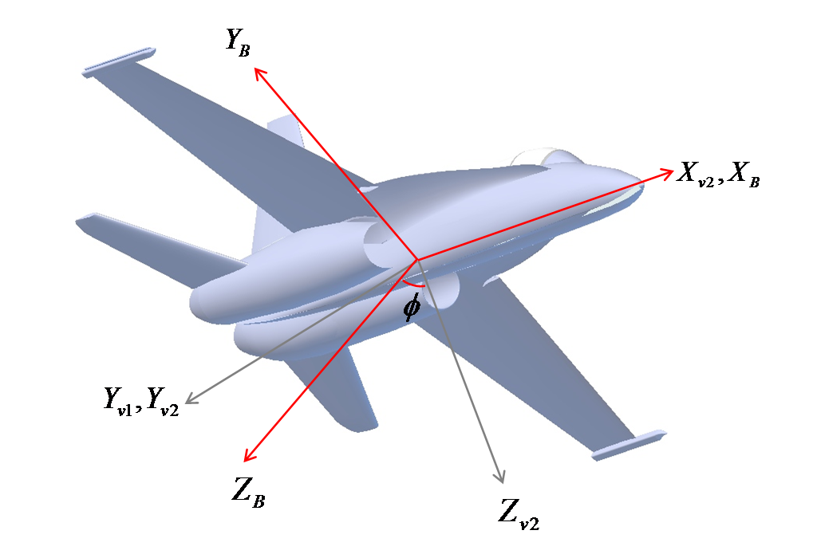
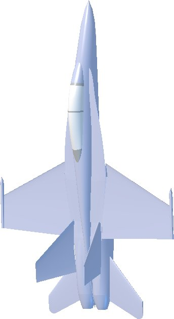

# Understanding Euler Angles

Changes in orientation are described by rotations in roll φ , pitch θ and yaw ψ about the x, y and z axes, respectively.

**Figure 1, Inertial Frame**

http://www.chrobotics.com/wp-content/uploads/2012/11/Inertial-Frame.png 

The MPU6050 can provide orientation information using both Euler Angles and Quaternions.  Compared to quaternions, Euler Angles are simple and intuitive and they lend themselves well to simple analysis and control.  On the other hand, Euler Angles are limited by a phenomenon called "Gimbal Lock," which we will investigate in more detail later.  In applications where the sensor will never operate near pitch angles of +/- 90 degrees, Euler Angles are a good choice.

Euler angles provide a way to represent the 3D orientation of an object using a combination of three rotations about different axes.  For convenience, we use multiple coordinate frames to describe the orientation of the sensor, including the "inertial frame," the "vehicle-1 frame," the "vehicle-2 frame," and the "body frame."  The inertial frame axes are Earth-fixed, and the body frame axes are aligned with the sensor.  The vehicle-1 and vehicle-2 are intermediary frames used for convenience when illustrating the sequence of operations that take us from the inertial frame to the body frame of the sensor.

### Inertial Frame

The "inertial frame" is an Earth-fixed set of axes that is used as an unmoving reference.  CH Robotics' sensors use a common aeronautical inertial frame where the x-axis points north, the y-axis points east, and the z-axis points down as shown below.  We will call this a North-East-Down (NED) reference frame.  Note that because the z-axis points down, altitude above ground is actually a negative quantity.

The sequence of rotations used to represent a given orientation is first yaw, then pitch, and finally roll.

### Vehicle-1 Frame 

As shown in Figure 1, yaw represents rotation about the inertial-frame z-axis by an angle ψ.  The yaw rotation produces a new coordinate frame where the z-axis is aligned with the inertial frame and the x and y axes are rotated by the yaw angle ψ.  We call this new coordinate frame the vehicle-1 frame.  The orientation of the vehicle-1 frame after yaw rotation is show in Figure 2.  The vehicle-1 frame axes are colored red, while the inertial frame axes are gray.

**Figure 2, Vehicle-1 Frame**

Rotation of a vector from the Inertial Frame to the Vehicle-1 Frame can be performed by multiplying the vector by the rotation matrix

Rv1I =  

|  |  |  |
| --- | --- | --- |
| cos(&psi;) | sin(&psi;) | 0 | 
| -sin(&psi;) | cos(&psi;) | 0 | 
| 0 | 0 | 1 |  

### Vehicle-2 Frame (Yaw and Pitch Rotation)

Pitch represents rotation about the vehicle-1 Y-axis by an angle θ as shown in Figure 3.  For clarity, the inertial-frame axes are not shown.  The vehicle-1 frame axes are shown in gray, and the vehicle-2 axes are shown in red.  It is important to note that pitch is NOT rotation about the inertial-frame Y-axis.

**Figure 3, Vehicle-2 Frame**

The rotation matrix for moving from the vehicle-1 frame to the vehicle-2 frame is given by

Rv2v1 =  

| | | |
| --- | --- | --- |
| cos(&theta;) | 0 | -sin(&theta;)  | 
|       0      | 1 | 0 | 
| sin(&theta;) | 0 | cos(&theta;) |  

The rotation matrix for moving from the inertial frame to the vehicle-2 frame consists simply of the yaw matrix multiplied by the pitch matrix:

Rv2I(θ,ψ)=Rv2v1(θ)Rv1I(ψ).

### Body Frame (Yaw, Pitch, and Roll Rotation)

The body frame is the coordinate system that is aligned with the body of the sensor.  On an aircraft, the body frame x-axis typically points out the nose, the y-axis points out the right side of the fuselage, and the z-axis points out the bottom of the fuselage.

The body frame is obtained by performing a rotation by the angle ϕ around the vehicle-2 frame x-axis as shown in Figure 4.  For clarity, the inertial frame and vehicle-1 frame axes are not shown.  The vehicle-2 frame axes are shown in gray, while the body-frame axes are shown in red.

**Figure 4, Body Frame**

The rotation matrix for moving from the vehicle-2 frame to the body frame is given by

RBv2(&phi;)=

| | | |
| --- | --- | --- |
|     1 |  0  | 0  |
| cos(&phi;)  | 0  | sin(&phi;) | 
| -sin(&phi;) | 0  | cos(&phi;) | 

The complete rotation matrix for moving from the inertial frame to the body frame is given by

RBI(ϕ,θ,ψ)=RBv2(ϕ) Rv2v1(θ) Rv1I(ψ).
 
 

### Gimbal Lock
Gimbal lock occurs when the orientation of the sensor cannot be uniquely represented using Euler Angles.  The exact orientation at which gimbal lock occurs depends on the order of rotations used.  On CH Robotics' sensors, the order of operations results in gimbal lock when the pitch angle is 90 degrees.

**Figure 5 - Gimbal Lock Condition** 

Intuitively, the cause of gimbal lock is that when the pitch angle is 90 degrees, yaw and roll cause the sensor to move in exactly the same fashion.  Consider Figure 5 for an illustration of the gimbal lock condition.  By following the sequence of rotations, it is easy to see that the orientation in Figure 5 can be obtained by yawing and then pitching, OR by pitching and then rolling.

An orientation sensor that uses Euler Angles will always fail to produce reliable estimates when the pitch angle approaches 90 degrees.  This is a fundamental problem of Euler Angles and can only be solved by switching to a different representation method, quaternions.  

### Using The Euler Angle Outputs of the Sensor
The rate gyros and accelerometers orientation sensors are aligned with the body frame of the sensor, so that if inertial frame data is needed, the sensor outputs must be converted from the body frame to the inertial frame.  This can be accomplished by performing a simple matrix multiplication using the matrices described above.

For example, suppose that we want to obtain inertial frame accelerometer data so that we can integrate acceleration to obtain velocity estimates in the north, east, and down directions.  Let vB be the measured body-frame acceleration vector reported by the sensor.  Then the inertial frame acceleration is given by

vI = RIB(ϕ,θ,ψ) vB.

The vector vI gives us the measured acceleration with respect to the inertial frame.  Note that this gives us the measured inertial-frame acceleration, not the actual acceleration.  A little more work is required before we can extract the physical acceleration of the sensor, and even then, the obtainable velocity accuracy using low-cost sensors is extremely poor.

Converting rate gyro data to the inertial frame is a little more complicated.  Like the accelerometer, the rate gyro data is reported with respect to the body frame of the sensor.  This means that the derivative of your Euler Angles is NOT what is being reported by the rate gyros.  If you want Euler Angle rates, the rate gyro data must be converted to the proper coordinate frames.  This is a little more complicated than it was for the accelerometers because each gyro angular rate must be converted to a different coordinate frame.  Recall that yaw represents rotation about the inertial frame z-axis, pitch represents rotation about the vehicle-1 frame y-axis, and roll represents rotation about the vehicle-2 frame x-axis.  Then to get the angular rates in the proper frames, the z-axis gyro output must be rotated into the inertial frame, the y-axis gyro output must be rotated into the vehicle-1 frame, and the x-axis gyro output must be rotated into the vehicle-2 frame.

The resulting transformation matrix for converting body-frame angular rates to Euler angular rates is given by

D(ϕ,θ,ψ)=

| | | |
| --- | --- | --- |
| 1  | sin(&phi;) tan(&theta;) | cos(&phi;)tan(&theta;)  |
| 0  | cos(&phi;)              | -sin(&phi;)             |
| 0  | sin(&phi;)/cos(&theta;) | cos(&phi;)/cos(&theta;) |

Let p represent the body-frame x-axis gyro output, q represent the body-frame y-axis gyro output, and r represent the body-frame z-axis output.  Then it follows that the Euler Angle rates are computed as

(&phi;dot  ) = p + q sin(&phi;)tan(θ)+rcos(ϕ)tan(θ)
(&theta;dot) = q cos(&phi;) - r sin(&theta;) 
(&psi; dot ) = q sin(&phi;)/cos(&theta;) + r cos(&phi;)/cos(&theta;)

This operation illustrates mathematically why gimbal lock becomes a problem when using Euler Angles.  To estimate yaw, pitch, and roll rates, gyro data must be converted to their proper coordinate frames using the matrix D.  But notice that there is a division by cos(θ) in two places on the last row of the matrix.  When the pitch angle approaches +/- 90 degrees, the denominator goes to zero and the matrix elements diverge to infinity, causing the filter to fail.
