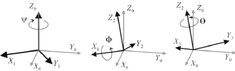

# Lesson 9 - Tilt Sensing Using a 3-axis Accelerometer

This lesson uses simple math relationships to approximate the x-axis and y-axis tilt angles from a three axis accelerometer. These approximations are reasonable for tilt angles less than 45 degrees, in a system with no vibration. Acceleration, due to vibration, is incorrectly interpreted as tilt. We will see how to filter out accelerometer vibration in lesson 11.

## What does an accelerometer measure?

1. Accelerometer sensors measure the difference between any linear acceleration in the accelerometer’s reference frame and the earth's gravitational field vector.

2. In the absence of linear acceleration, the accelerometer output is a measurement of the rotated gravitational field vector and can be used to determine the accelerometer pitch and roll orientation angles.

https://www.researchgate.net/profile/Hristijan_Gjoreski/publication/259340414/figure/fig3/AS:297261767643138@1447884136270/A-rotation-represented-by-Euler-angles-pitch-roll-yaw-with-ps-ph-th-60-30.png 

3. The orientation angles are dependent on the order in which the rotations are applied. 

There are six sequences for any physical rotation:

- R-xyz
- R-xzy
- R-zxy
- R-zyx
- R-yxz
- R-yzx

Different rotation sequences may result in the same orientation and produce different pitch andd roll angles. For consistency, we define a default sequence. The most common order is the aerospace sequence of yaw, pitch and roll rotation.

4. Accelerometer sensors are insensitive to rotation about the earth's gravitational field vector. The equations for the roll and pitch angles therefore have mathematical instabilities when rotation axes happen to become aligned with gravity and point upwards or downwards.  

## Coordinate System Definition

The accelerometer has its own native coordinate system. Our experiments with the MPU-6050 will measure the pcb's orientation. When the MPU-6050 is mounted on our robot, we will need to translate data measured in the MPU-6050's coordinate frame to our robot's body frame. This will be covered in a later lesson. See EulerAngles.md for illustrations of coordinate reference frames.

For the MPU-6050, we adopt the convention that the accelerometer output is negated to give the value +1g in any axis aligned wih the earth's downward gravitational vector.

The three-axis accelerometer oriented in the earth's gravitational field **g** and undergoing linear acceleration **ar** measured in the earth's reference frame r, will have the output **Gp** given by

**Gp** =  

| Gpx | 
| Gpy |  = R(g - ar) 
| Gpz | 

where R is the rotation matrix describing the orientation of the device relative to the earth's coordinate frame.

For accurate orientation angles, it is assumed that 
- The accelerometer has no linear acceleration ar = 0. This assumption is needed to solve Equation 1 for the rotation matrix R and, in consequence, any linear acceleration from handshake or other sources will introduce errors into the orientation estimate. 
- The initial orientation of the device is lying flat with the earth's gravitational field aligned with the device's z-axis:

**Gp** =  

| Gpx |  = | 0 | 
| Gpy |  = | 0 | 
| Gpz |  = | 1 | 

## Estimating Roll and Pitch with Accelerometer Data

We can only measure roll and pitch angles using the accelerometer. Yaw is the rotation about the Z axis. If we think about rotatation about the Z-axis (yaw), we will always read a constant 1G in the z axis direction, no matter how the accelerometer is rotated about z. Measuring yaw rotation requires the gyroscope. That will be covered in the another lesson.

Accelerometers are more sensitive to small changes in tilt when they are perpendicular to gravity. I.e. when horizontal, small changes in tilt give useful readings. Past about 45 degrees of tilt they become increasingly less sensitive. 

With a Triple axis accelerometer the z axis will be measuring 1g with the device horizontal. When tilted, the x and y axis measurements tell us the components of the gravity vector in those directions.

## Estimating Roll and Pitch using Rxyz 

An estimation of the rotation Rxyz roll angle &phi; and pitch angle &theta from [Freescale](./datasheets/AN3461.pdf), equations 25 and 26

Roll angle: tan &phi;xyz = (Gpy)/(Gpz)

Pitch angle: tan &theta;xyz = (-Gpx)/(sqrt(Gpy2 + Gpz2)

where Gpx, Gpy, Gpz are the accelerometer x, y, and z measurements, respectively.

## lesson9a.ino

The program [lesson9a.ino](lesson9a.ino) measures the tilt of the x and y axes with regard to the gravity vector. Run the program to view the tilt angles. 

>Notes 
    >> The tangent function is undefined at 90 degrees, which makes this method problematic for robotic applications. 
    >> What happens when the board is not tilted, but vibrated? (Says the board is tilted when it is not.) 
>Conclusion: this is not the best method for measuring tilt angle. 
  

## atan versus atan2

Compares the atan and atan2 functions.

## lesson9b.ino

Lesson 9b uses the atan and atan2 function to eliminate duplicate solutions.
