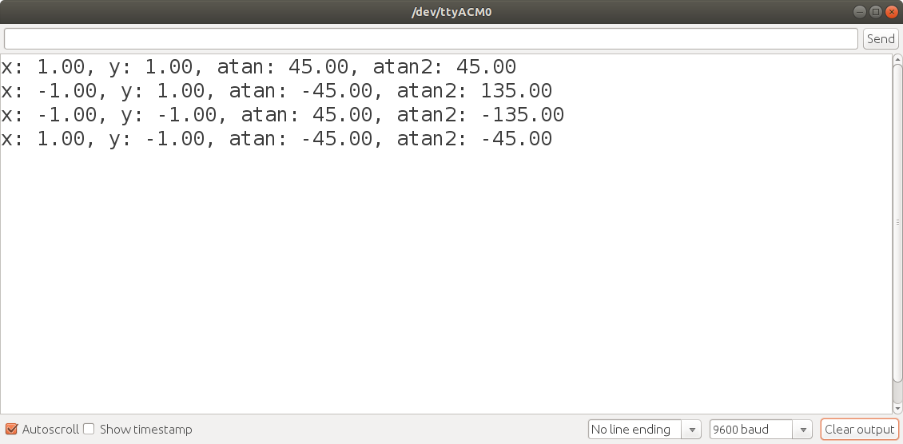
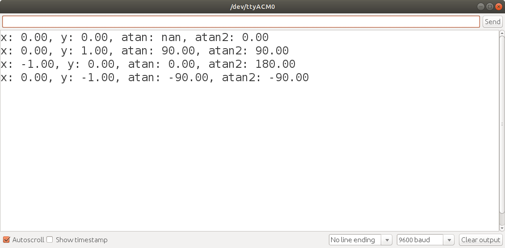

# Lesson: atan versus atan2

C++ has two math library functions that calculate the arctangent of an angle: atan, atan2. The atan function only provides angles for quadrants I and IV. The atan2 function provides angles for all four quadrants.

The tangent is defined as tan(&alpha;) = sin(&alpha;) / cos(&alpha;). The sign of the tan, cos, and sin are defined as shown in the table below.

| Quadrant | Angle | sin | cos | tan |
| --- | --- | --- | --- | --- |
| I   |  0 < &alpha; < &pi;/2       | + | + | + |
| II  |  &pi;/2 < &alpha; < &pi;    | + | - | - |
| III |  &pi; < &alpha; < 3&pi;/2   | - | - | + |
| IV  |  3&pi;/2 < &alpha; < 2&pi;  | - | + | - |
 
 

## atan function

**Prototype**: double atan(double x)

Parameter: x - value whose arctangent is computed  

Return Value - Principal arc tangent of x, in the interval [-pi/2,+pi/2] radians.
One radian is equivalent to 180/PI degrees.

> The atan function calculates the inverse tangent from the value x that represents the ratio of the sin/cos. When this ratio is positive, the angle is assumed to be in the first quadrant. When the ratio is negative, the angle is assumed to be in the fourth quadrant. These angles are in the interval [ -pi/2, +pi/2] radians.

## atan2 function

The atan2 function calculates the inverse tangent from two parameters. It is able to resolve all four quadrants based on the sign of the arguments.

**Prototype**: double atan2( double y, double x);

Parameters 
y - value representing the y-coordinate  
x - value representing the x-coordinate  

Return Value - Principal arc tangent of y/x, in the interval [-pi, +pi] radians 
If a domain error occurs, an implementation-defined value is returned (NaN where supported). Domain errors may occur if x and y are both zero.  
If a range error occurs due to underflow, the correct result (after rounding) is returned.  

Error Handling: https://en.cppreference.com/w/cpp/numeric/math/atan2
 

## atan_vs_atan2.ino

The [atan_versus_atan2.ino](./atan_versus_atan2/atan_vs_atan2.ino) produces the following output. atan2 distinguishes the correct quadrants, while atan's angle is incorrect for quadrants 2 and 3.

 
 

## atan_vs_atan2_undefined.ino

The [atan_versus_atan2_undefined.ino](./atan_vs_atan2_undefined/atan_vs_atan2_undefined.ino) produces the following output. The Arduino 1.8.10 atan2 implementation is able to handle angles where the tangent is mathematically undefined.

 
 

## Is it better to use atan or atan2?

In general atan2 is the better choice, as it is able to resolve quadrants and resolve angles where the tangent is undefined. 

