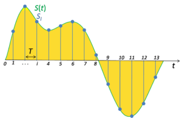
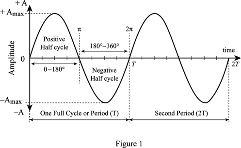
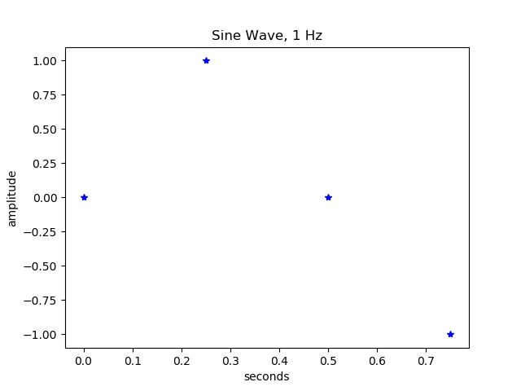
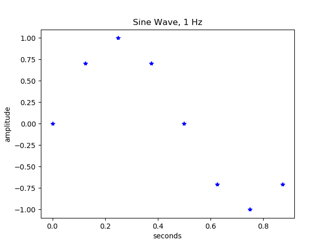
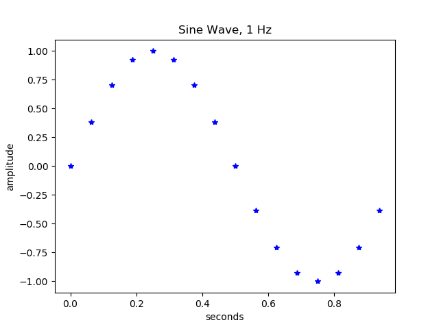

# Sampling a Signal

In signal processing, sampling is the reduction of a continuous-time signal to a discrete-time signal. A common example is the conversion of a sound wave (a continuous signal) to a sequence of samples (a discrete-time signal).</br>

 [1](https://upload.wikimedia.org/wikipedia/commons/thumb/5/50/Signal_Sampling.png/300px-Signal_Sampling.png)
</br></br>

A sample is a single value or set of values at a point in time and/or space. The original signal is retreivable from a sequence of samples, up to the Nyquist limit,by passing the sequence of samples through a type of low pass filter called a reconstruction filter. This filter is used to construct a smooth analog signal from a digital input. For example, a DAC (digital to analog converter).
</br></br>

## Nyquist-Shannon Sampling Theorem

The Nyquist-Shannon sample theorem establishes a suffcient condition for a sample rate that permits a discrete sequence of samples to capture all the information from a continuous-time signal of finite bandwidth. Bandwidth is the difference between the upper and lower frequencies in a continuous band of frequencies.

The theorem applies to a class of mathematical functions having a Fourier transform that is zero outside of a finite region of frequencies. We will not venture into the mathematics. Our interest lies in understanding the meaning of sampling and how the sampling rate may affect our data measurements.

 [2](https://upload.wikimedia.org/wikipedia/commons/thumb/f/f7/Bandlimited.svg/250px-Bandlimited.svg.png)
</br></br>

Shannon's theorem: If a function x(t) contains no frequencies higher than B hertz, it is completely determined by giving its ordinates at a series of points spaced 1/(2B) seconds apart.

A sufficient sample-rate is anything larger than 2B samples per second. For a given sample rate f<sub>s</sub>, perfect reconstruction is guaranteed for a bandlimit B < f<sub>s</sub>/2.

The threshold 2B is called the **Nyquist rate** and is an attribute of the continuous-time input x(t) to be sampled. The sample rate must exceed the Nyquist rate for the samples to suffice to represent x(t).

The threshold fs/2 is called the **Nyquist frequency** and is an attribute of the sampling equipment. All meaningful frequency components of the properly sampled x(t) exist below the Nyquist frequency. When the Nyquist criterion is not met (B >  f<sub>s</sub>/2), a condition called aliasing occurs, which causes distortion.

## Sine Wave Example

A sine wave is a mathematical curve that describes a smooth periodic oscillation. It is a continuous wave, a graph of the sine function. Stated as a function of time

y(t) = A sin(2 &pi; f t + &phi;) = A sin(&omega; t + &phi;)

where 
- A, amplitude
- f, frequency, the number of oscillations(cycles) that occur each second of time, units: Hz
- &omega; = 2&pi;f, angular frequency, units: radians per second
- &phi;, phase, specifies (in radians) where in its cycle the ocsillation is at t = 0.
</br></br>

 [3](https://media.cheggcdn.com/study/1e7/1e7555e8-09bd-40db-956f-a99165319ded/DC-1341V1.png)
</br></br>

### Discrete-time Sine Wave

How does a computer program generate a smooth sine wave plot? We will use some python examples to illustrate the concepts of sampling and the Nyquist rate.

The python math library's sin function: sin(x) calculates the sine of x in radians. It returns a numeric value in the range [-1, 1].

The code below prints the sin values of a few angles. See sine_example.py. 

```python
import math 

print(math.sin(0))               # 0 degrees
print(math.sin(math.pi/4))       # 45 degrees
print(math.sin(math.pi/2))       # 90 degrees
print(math.sin(math.pi))         # 180 degrees
```

Our objective is to generate a plot that uses discrete-time values to resemble the continous-time signal. The plot will contain one complete cycle of a sine wave.

We defined the continuous time signal as y(t) = A sin(2 &pi; f t + &phi;) = A sin(&omega; t + &phi;)

The discrete-time signal: y[n] = A sin(2 &pi; f n Ts + &phi;)= A sin(&omega; n Ts + &phi;) where n is the sample number.</br>

Let's create a sine wave with a frequency of 1 Hz and phase angle of zero.
- f is 1 Hz
- &omega; = 2&pi;f 
- &Ts is the time interval between samples, aka the sample period
- n is the sample number

Our signal frequency f is 1 Hz. The time period for one cycle T = 1/f = 1/(1 Hz) = 1 sec.

How many samples do we need to represent our signal? The bandwidth B is 1 Hz (1 Hz - 0 Hz). Twice the bandwidth B is 2B = 2(1 Hz) = 2 Hz. Our sample rate, f<sub>s</sub> should be greater than 2 Hz.

If our sample rate, f<sub>s</sub>, were 4Hz, which is 4 samples/sec, then the sample period, Ts, (time between samples) is Ts = 1/f<sub>s</sub>, Ts = 1/4 Hz = 0.25 sec. This means over a total time interval of 1 sec (the time period T for our signal frequency f = 1Hz), we will measure sin(2&pi;ft) at t = nTs, n will vary from 0 to 3, while Ts remains 0.25 sec.

| n | Ts | n Ts |
| --- | --- | --- |
| 0 | 0.25 | 0.0  |
| 1 | 0.25 | 0.25 |
| 2 | 0.25 | 0.50 |
| 3 | 0.25 | 0.75 |


Thus, we take a total of 4 sample measurements to represent one complete cycle of a 1 Hz sine wave. 

The program, sine_list.py, generated the images shown below. The sample frequency in the first image was 4 times the signal frequency. The sample frequency in the second image was 8 times signal frequency, while the third image shows 16 times signal frequency. It is obvious that the larger signal frequencies, with more data samples, better represent the continuous time signal.

 
</br></br>

 
</br></br>

 
</br></br></br>

Experiment with the source code by changing the signal frequency and number of cycles.
</br></br>

```python
'''
Objective: Illustrate how sample frequency affects 
representation of time domain signal. 

'''
import math
import matplotlib.pyplot as plt 

# signal parameters
signalFrequency = 1                    # units: Hz, cycles/sec
signalPeriod   = 1 / signalFrequency   # units: sec/cycle

# sample parameters
sampleFrequency = signalFrequency * 8  # units: samples/sec
samplePeriod = 1 / sampleFrequency     # units: sec/sample  (time between samples)


numCycles = 1                                  # number of signal cycles
totalSamples = int(numCycles/samplePeriod)     # units: cycles/(sec/samplematp)
n = 0                                  # sample number


sinValues = []                   # create empty list
timeValues = []

while(n < totalSamples):
   sinValues.append(math.sin(2*math.pi*signalFrequency*n*samplePeriod))
   timeValues.append(n*samplePeriod)
   n = n + 1

print(sinValues)

plt.plot(timeValues, sinValues, 'b*')
plt.title('Sine Wave, ' + str(signalFrequency) + ' Hz')
plt.xlabel('seconds')
plt.ylabel('amplitude')
plt.show()
```
